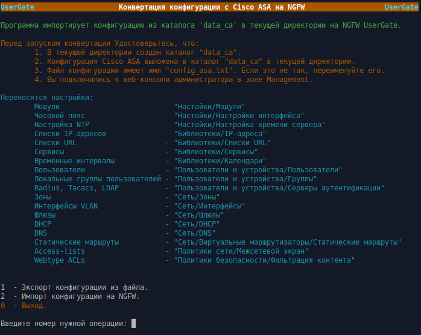

<h2 align="center">Конвертация конфигурации с Cisco ASA на NGFW UserGate</h2>
<h3 align="center">(Версия 2.7)</h3>

Программа предназначена для переноса конфигурации с оборудования Cisco ASA на NGFW UserGate версии 7.

Программа работает в Ubuntu версии 20.10 или выше. 
<b>Обращаем ваше внимание:</b> если вы запускаете данную программу в Ubuntu более старой версии или в другой разновидности
Linux, вы делаете это на свой страх и риск. Компания UserGate в этом случае ничем вам не может помочь.

Для работы программы на зоне интерфейса, используемого для веб-консоли администратора, необходимо включить сервис xml-rpc.
Если используется зона Management, то это делать не надо, так как сервис xml-rpc на интерфейсе Management включён по умолчанию.
1. Открыть веб-консоль администратора таким образом: https://<usergate_ip>:8001/?features=zone-xml-rpc
2. В настройках нужной зоны активировать сервис "XML-RPC для управления".

<b>Порядок испльзования:</b>
1. Перед началом работы на NGFW UserGate настроить DNS, интерфейс Untrusted (для выхода в интернет), шлюз,
произвести активацию корректным ПИН-кодом. После этого дождаться обновления библиотек и списков.
2. Пользователи с административными правами (администраторы Cisco) не переносятся, поэтому создайте профили администраторов с
необходимыми разрешениями. После этого создайте необходимое количество администраторов.
3. Скачайте архив <b>asa_convert_config.zip</b> и распакуйте его. Файл <b>asa_convert_config</b> сделайте исполняемым.
3. Создайте в текущей директории каталог <b>data_ca</b>.
4. Переименуйте файл конфигурации Cisco ASA в <b>config_asa.txt</b> и скопируйте в каталог <b>data_ca</b>.
5. При запуске программа запрашивает ip узла, login и пароль администратора NGFW. Проверьте, что у администратора,
логин которого используете, в профиле включены разрешения для API.
6. Запустите <b>asa_convert_config</b> в терминале.

<b>Примечания:</b>
1. Если на Cisco ASA в настройках подключения к AD Windows использовались криптографические пароли, то после конвертации серверов
аутентификации LDAP необходимо в настройках соответствующего LDAP-адаптера ввести необходимый логин/пароль для коннектора.
Если нет, то LDAP-коннектор сразу автоматически подключается к контроллеру домена.
2. При импорте, интерфейсы VLAN получают IP-адреса из конфигурации Cisco ASA. Проследите, чтобы не было конфликта IP-адресов
в ваших сетях.
3. Интерфейсы VLAN после импорта находятся в неактивированном состоянии. Вам необходимо проверить все VLAN,
по необходимости откорректировать их, удалить ненужные и добавить необходимые. После этого включить и проверить их работу.
4. При импорте локальных пользователей, пароли не переносятся. Вам надо вручную задать пароли для всех пользователей
или настроить авторизацию по IP/MAC/VLAN.
5. При импорте локальных пользователей, тире и пробел в логине заменяются на символ подчёркивания. Точка, прямой и
обратный слеши убираются.
6. Доменные группы из Local User Groups не переосятся, так как на NGFW нельзя задать доменные группы в локальных группах.
7. При конвертации access-list не активные ACE пропускаются. Так же пропускаются access-list не привязанные к интерфейсу.
8. После конвертации access листов в правила межсетевого экрана UG NGFW, межсетевой экран будет работать ожидаемо не так как
это происходило на Cisco ASA. В UG NGFW межсетевой экран оперирует зонами, которые присваиваются определённым интерфейсам.
Кроме того правила NAT и DNAT не требуют создания правил МЭ, так как сами создают скрытые, необходимые для работы, правила МЭ.
Поэтому дополнительно разрешать данный трафик нет необходимости и соответствующие правила МЭ надо удалить.
9. ACE for Security-Based Matching (Cisco TrustSec) не конвертируются, так как данная технология отсутствует на UG NGFW.
10. EtherType ACLs не поддерживаются.
11. Standard ACLs не конвертируются. Необходмио создать соответствующие разрешения в протоколах маршрутизации виртуальных маршрутизаторов.
12. ACE for URL Matching - данный тип преобразуется в правила контентной фильтрации. В связи с этим не поддерживаются протоколы:
cifs://, citrix://, citrixs://, imap4://, nfs://, pop3://, smart-tunnel://, smtp://. Конвертируются только ACE с типом протокола http://,
https:// и ftp://. Так же не поддерживается wildcards в протоколах, например htt* или *://example.com и символы "?" и квадратные скобки [].
Для неподдерживаемых в правилах контентной фильтрации протоколов необходимо создать соответствующие правила МЭ.
13. Если вы делаете импорт не всей конфигурации, то необходимо учитывать, что разделы конфигурации взаимосвязаны друг с
другом. Поэтому импорт определённого раздела пройдёт без ошибок только если ранее был выполнен импорт всех предыдущих
пунктов этого меню. Лучше импорт делать по разделам с первого до последнего, проверяя сообщения каждого раздела на предмет ошибок.
14. Некоторые правила NAT не будут конвертированы, так как идеология данных правил на UG NGFW отличается от Cisco. Вам необходимо проверить
все правила, изменить существующие и создать недостающие.
15. В общем случае, UG NGFW обладает гораздо большими возможностями по управлению трафиком чем Cisco ASA. Поэтому рекомендуется
настроить SSL инспектирование, правила фильтрации контента и веб-безопасности, СОВ, защиту почтового трафика и DoS, а так же
использовать другие возможности, предоставляемые данным решением.

<b>Переносятся настройки:</b>
- Модули                            - "UserGate/Настойки/Модули"
- Часовой пояс                      - "UserGate/Настройки/Настройки интерфейса/Часовой пояс"
- Настройка NTP                     - "UserGate/Настройки/Настройка времени сервера"
- Списки IP-адресов                 - "Библиотеки/IP-адреса"
- Списки URL                        - "Библиотеки/Списки URL"
- Сервисы                           - "Библиотеки/Сервисы"
- Временные интервалы               - "Библиотеки/Календари"
- Локальные Пользователи            - "Пользователи и устройства/Пользователи"
- Локальные группы пользователей    - "Пользователи и устройства/Группы"
- Radis, Tacacs+, LDAP              - "Пользователи и устройства/Серверы аутентификации"
- Зоны                              - "Сеть/Зоны"
- Интерфейсы VLAN                   - "Сеть/Интерфейсы"
- Шлюзы                             - "Сеть/Шлюзы"
- DHCP                              - "Сеть/DHCP"
- Системные DNS                     - "Сеть/DNS/Системные DNS-серверы"
- Правила DNS                       - "Сеть/DNS/DNS-прокси/Правила DNS"
- Статические маршруты              - "Сеть/Виртуальные маршрутизаторы/Статические маршруты"
- Access-lists                      - "Политики сети/Межсетевой экран"
- NAT, DNAT, Port-форвардинг        - "Политики сети/NAT и маршрутизация"
- Webtype ACLs                      - "Политики безопасности/Фильтрация контента"

