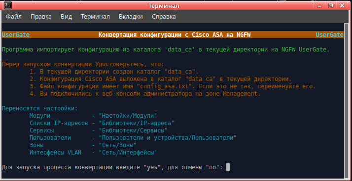

<h2 align="center">Конвертация конфигурации с Cisco ASA на NGFW UserGate</h2>
<h3 align="center">(Версия 2.0)</h3>

Программа предназначена для переноса конфигурации с оборудования Cisco ASA на NGFW UserGate версии 6.

Для работы программы на зоне интерфейса, используемого для веб-консоли администратора, необходимо включить сервис xml-rpc.
Если используется зона Management, то это делать не надо, так как сервис xml-rpc на интерфейсе Management включён по умолчанию.
1. Открыть веб-консоль администратора таким образом: https://<usergate_ip>:8001/?features=zone-xml-rpc
2. В настройках нужной зоны активировать сервис "XML-RPC для управления".

<b>Порядок испльзования:</b>
1. Перед началом работы на NGFW UserGate настроить DNS, интерфейс Untrusted (для выхода в интернет), шлюз,
произвести активацию корректным ПИН-кодом. После этого дождаться обновления библиотек и списков.
2. Скачать архив <b>convert_config.zip</b>, распаковать, файл <b>convert_config</b> сделать исполняемым.
3. Создать в текущей директории каталог <b>data_ca</b>.
4. Переименовать файл конфигурации Cisco ASA в <b>config_asa.txt</b> и скопировать в каталог <b>data_ca</b>.
5. При запуске программа запрашивает ip узла, login и пароль администратора NGFW. Проверьте, что у администратора,
логин которого используете, в профиле включены разрешения для API.
6. Запустить <b>convert_config</b> в терминале.

<b>Примечания:</b>
1. Программа работает в Ubuntu версии 20.04 LTS или выше. Если вы запускаете данную программу в Ubuntu более старой
версии или в другой разновидности Linux, вы делаете это на свой страх и риск. Компания UserGate в этом случае ничем
вам не может помочь.
2. При импорте, интерфейсы VLAN получают IP-адреса из конфигурации Cisco ASA. Проследите, чтобы не было конфликта
IP-адресов в ваших сетях.
3. Интерфейсы VLAN после импорта находятся в неактивированном состоянии. Вам необходимо проверить все VLAN,
по необходимости откорректировать их, удалить ненужные и добавить необходимые. После этого включить и проверить их работу.
4. При импорте локальных пользователей, пароли не переносятся. Вам надо вручную задать пароли для всех пользователей
или настроить авторизацию по IP/MAC/VLAN.
5. При импорте локальных пользователей, тире и пробел в логине заменяются на символ подчёркивания. Точка, прямой и
обратный слеши убираются.

<b>Переносятся настройки:</b>
- Модули                - "Настойки/Модули"
- Списки IP-адресов     - "Библиотеки/IP-адреса"
- Списки URL            - "Библиотеки/Списки URL"
- Сервисы               - "Библиотеки/Сервисы"
- Пользователи          - "Пользователи и устройства/Пользователи"
- Зоны                  - "Сеть/Зоны"
- Интерфейсы VLAN       - "Сеть/Интерфейсы"
