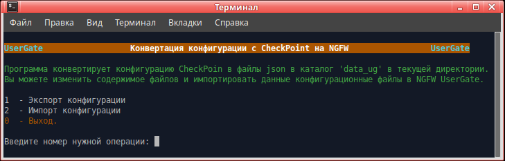

<h3>Конвертация конфигурации с CheckPoint на UserGate (Версия 1.0)</h3>

Программа предназначена для переноса конфигурации с оборудования Check Point на NGFW UserGate.
Программа работает в Linux.

При конвертации конфигурации создаются файлы в формате json с конфигурацией разделов.
Затем можно внести необходимые изменения в данные файлы и импортировать изменённые файлы конфигурации.

Для работы программы на зоне интерфейса, используемого для веб-консоли администратора, необходимо включить сервис xml-rpc.
Если используется зона Management, то это делать не надо, так как сервис xml-rpc на интерфейсе Management включён по умолчанию.
1. Открыть веб-консоль администратора таким образом: https://<usergate_ip>:8001/?features=zone-xml-rpc
2. В настройках нужной зоны активировать сервис "XML-RPC для управления".

Порядок испльзования:
1. Скачать архив <b>convert_checkpoint_config.zip</b>, распаковать, файл <b>convert_config.py</b> сделать исполняемым.
2. Получить конфигурацию Check Point <b>show package</b>.
3. Разархивировать полученный файл в каталог <b>convert_checkpoint_config/data_cp</b>.
4. Запустить на Check Point команду <b>save configuration config_cp.txt</b>.
5. Файл <b>config_cp.txt</b> поместить в каталог <b>convert_checkpoint_config/data_cp</b>.
6. Запустить <b>convert_config.py</b> в терминале.
7. Выбрать "Экспорт конфигурации". Будет произведена конвертация конфигурации Check Point в формат UserGate.
8. Выбрать "Импорт конфигурации" для импорта конвертированной конфигурации на NGFW UserGate.

После конвертации, перед импортом на NGFW UserGate, программа запрашивает ip узла, login и пароль администратора NGFW.

<b>Примечания:</b>
1. Для полноценного переноса конфигурации (с сервисами, списками UsrGate, морфологией и другими разделами библиотеки)
необходимо перед началом работы на NGFW UserGate настроить DNS, интерфейс Untrusted (для выхода в интернет), шлюз,
произвести активацию корректным ПИН-кодом. После этого дождаться обновления библиотек и списков. 
2. Если у Вас в правилах используются доменные пользователи и группы, то перед импортом конфигурации необходимо в первую
очередь на NGFW UserGate настроить DNS, затем создать LDAP-коннектор, загрузить keytab-файл, если используется авторизация
kerberos, и проверить его работу.
3. Правила межсетевого экрана и контентной фильтрации после импорта находятся в неактивированном состоянии. Вам необходимо
проверить все правила, по необходимости откорректировать их, удалить ненужные и добавить необходимые. После этого включить
нужные правила и проверить их работу.

<b>В настоящее время реализован импорт:
- сервисов,
- списков URL,
- списков IP-адресов,
- групп URL категрий,
- категорий приложений,
- настроек физических интерфейсов,
- интерфейсов VLAN,
- статических маршрутов,
- правил межсетевого экрана,
- правил фильтрации контента.
</b>
