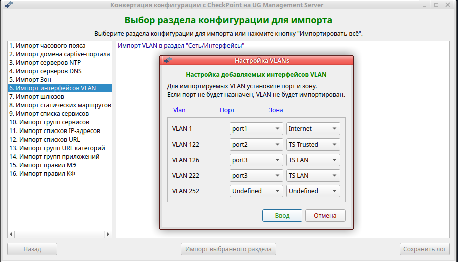

<h2 align="center">Конвертация конфигурации с CheckPoint на UserGate Management Server</h2>
<h3 align="center">(Версия 1.6)</h3>

Программа предназначена для переноса конфигурации с оборудования Check Point R80.40 в шаблон NGFW Management Server UserGate v.7.

Программа работает в Ubuntu версии 23.10 или выше. 
<b>Обращаем ваше внимание:</b> если вы запускаете данную программу в Ubuntu более старой версии или в другой разновидности
Linux, вы делаете это на свой страх и риск. Компания UserGate в этом случае ничем вам не может помочь.

Для работы программы на зоне интерфейса, используемого для веб-консоли администратора, необходимо включить сервис xml-rpc.
Если используется зона Management, то это делать не надо, так как сервис xml-rpc на интерфейсе Management включён по умолчанию.
1. Открыть веб-консоль администратора таким образом: https://<usergate_ip>:8001/?features=zone-xml-rpc
2. В настройках нужной зоны активировать сервис "XML-RPC для управления".

<b>Порядок испльзования:</b>
1. Перед началом работы на MC UserGate настроить DNS, шлюз, проверить выход в интернет,произвести активацию корректным ПИН-кодом.
После этого ОБЯЗАТЕЛЬНО дождаться обновления библиотек и списков.
2. Создайте профиль администратора области, администратора области и область для размещения шаблона NGFW.
3. Можно сразу создать шаблон для импорта конфигурации или создать его позже из программы переноса конфигурации.
4. Если у Вас на CheckPoint использовались доменные пользователи и группы, то перед импортом конфигурации необходимо в
каталогах пользователей области создать LDAP-коннектор, загрузить keytab-файл, если используется авторизация kerberos, и проверить
его работу. Это небходимо для переноса доменных пользователей и групп в правилах межсетевого экрана и контертной фильтрации.
5. Скачайте архив <b>cp-mc7_convert_config.zip</b> и распакуйте его. Файл <b>cp-mc7_convert_config</b> сделайте исполняемым.
6. Создайте в текущей директории каталог <b>data_cp</b>.
7. Выгрузите конфигурацию Check Point <b>show package</b>.
8. Разархивируйте полученный файл в каталог <b>data_cp</b>.
9. Запустите на Check Point команду <b>save configuration config_cp.txt</b>.
10. Файл <b>config_cp.txt</b> поместите в каталог <b>data_cp</b>.
11. После конвертации конфигурации CheckPoint в формат UG MC, перед импортом в шаблон NGFW, программа запрашивает ip Management
Server, login и пароль администратора области.
12. Запустите программу <b>cp-mc7_convert_config</b>. Программа выполняется в графической среде.
13. Выберите "Экспорт конфигурации". Будет произведена конвертация конфигурации Check Point в формат UserGate в каталог <b>data_ug</b>.
14. Выбрать "Импорт конфигурации" для импорта конвертированной конфигурации в шаблон NGFW Сервера управления.

<b>Ограничения:</b> 
1. Перед экспортом конфигурации с Check Point, замените всё что написано в русском регистре на английский регистр. Имена
правил, объектов и т.д. в русском регистре не будут импортированы на UG NGF, так как разрешён только английский регистр.
Специальные символы так же запрещены. Разрешается использовать только символы: "(", ")", "+", "-", "_", ".". В комментариях
русские буквы после импорта будут представлены кракозябрами.
2. Порт в сервисах должен содержать только цифры и тире для диапазонов. Символы ">", "<" и т.п. не поддерживаются. Такие
сервисы не переносятся.
3. Правила МЭ и КФ с длинными именами (более 256 символов с учётом utf-8) не переносятся. Измените имена.
4. Имена IP-листов должны быть только в английском регистре. Длина имени не должна превышать максимально допустимую длину имени
файла в Linux (т.е. 255 байт). При превышении такой IP-лист не конвертируется и не буден использован в правилах.
5. Настройки arp proxy не переносятся, так как идеология данного функционала на UG NGFW отличается от CheckPoint. Если необходимо,
настройте arp proxy на интерфейсах через CLI.
6. Настройки протоколов динамической маршрутизации (ospf, bgp) не переносятся. Необходимо настроить их в шаблоне NGFW заново руками.
7. Адреса IPV6 не поддерживаются. Поэтому объекты host, network c такими адресами не переносятся.
8. У всех объектов конфигурации CheckPoint должны быть имена. Если у объекта нет имени, при импорте ему присвоиться автоматически
сгенерированное имя (например: b2d0ddf1d78).

<b>Примечания:</b> 
1. Если вы делаете импорт не всей конфигурации, то необходимо учитывать, что разделы конфигурации взаимосвязаны друг с другом.
Поэтому импорт определённого раздела пройдёт без ошибок только, если ранее был выполнен импорт всех предыдущих разделов конфигурации.
Импорт лучше делать по разделам с первого до последнего, проверяя сообщения каждого раздела в журнале на предмет ошибок.
2. После импорта часового пояса, настройки NTP и домена captive-портала, эти настройки находятся в не активированном состоянии.
Для их активации установите флажок "Синхронизировать" в этих настройках.
3. Если импортируете VLAN, то перед этим создайте необходимые интерфейсы.
4. Перед импортом VLAN, создайте в шаблоне NGFW необходимое количество зон, так как при импорте VLAN надо будет указать зону
для каждого интерфейса.
5. Интерфейсы VLAN после импорта находятся в не активированном состоянии. Вам необходимо проверить все VLAN, по необходимости
откорректировать их, удалить не нужные и добавить необходимые. После этого включить и проверить их работу.
6. Статические маршруты после импорта находятся в неактивированном состоянии. Вам надо включить нужные и проверить их работу.
7. Access-rule могут конвертироваться в 2 правила (МЭ и КФ). Если в access-rule используются сервисы и/или приложения, то правило
попадает в раздел "Политики сети/Межсетевой экран". В раздел "Политики безопасности/Фильтрация контента" правило попадёт
если в нём используются URL и/или Категории URL.
8. Если сервис из access-rule трансформировался в категории URL и список URL в правиле контентной фильтрации, то правило сработает
только при совпадении этих 2-х условий (логическое 'И'). То есть правило будет работать не так как на CheckPoint, где это логическое
'ИЛИ'. В этом случае получившееся правило КФ надо разбить на два (в первом использовать категории URL, во втором список URL).
9. Правила межсетевого экрана и контентной фильтрации после импорта находятся в неактивированном состоянии. Вам необходимо
проверить все правила, по необходимости откорректировать их, удалить ненужные и добавить необходимые. После этого включить
нужные правила и проверить их работу.
10. После конвертации конфигурации CheckPoint на UG NGFW, UG NGFW будет, скорее всего, работать не совсем так как возможно ожидается.
Это связано с несколько разной идеологией в архитектуре устройства, построении правил, разным набором приложений, категорий URL
и сигнатур СОВ. Необходимо тщательно протестировать все правила и при необходимость скорректировать их.

<b>Внимание!</b>  Если в процессе работы с программой возникнут проблемы, обратитесь в техподдержку компании UserGate.

<b>В настоящее время реализован импорт:</b>
- зон,
- интерфейсов VLAN,
- шлюзов,
- часового пояса,
- серверов DNS,
- серверов NTP,
- статических маршрутов,
- сервисов и групп сервисов,
- списков IP-адресов и групп IP-адресов,
- списков URL,
- групп URL категорий,
- групп приложений,
- правил межсетевого экрана,
- правил контентной фильтрации.

27.05.2024  Исправлены имена правил МЭ и КФ в случае одинаковых имён. 
22.05.2024  Исправлен экспорт пользователей с русскими именами в правилах МЭ и КФ. 
22.05.2024  Исправлен экспорт групп сервисов для ICMP. 
17.11.2023  Исправлен экспорт сервисов, групп IP-адресов и правил FW и КФ. 
14.11.2023  Переделан импорт списков URL. 
10.11.2023  Добавлена конвертация встроенных сервисов CheckPoint. 
