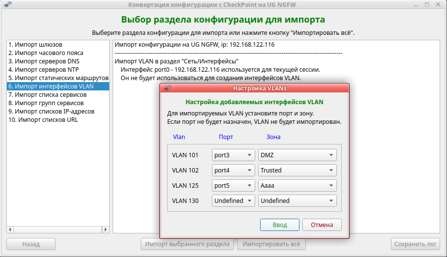

<h2 align="center">Конвертация конфигурации с CheckPoint на UserGate</h2>
<h3 align="center">(Версия 2.5)</h3>

Программа предназначена для переноса конфигурации с оборудования Check Point R80.40 на NGFW UserGate v.7.

Программа работает в Ubuntu версии 20.10 или выше. 
<b>Обращаем ваше внимание:</b> если вы запускаете данную программу в Ubuntu более старой версии или в другой разновидности
Linux, вы делаете это на свой страх и риск. Компания UserGate в этом случае ничем вам не может помочь.

Для работы программы на зоне интерфейса, используемого для веб-консоли администратора, необходимо включить сервис xml-rpc.
Если используется зона Management, то это делать не надо, так как сервис xml-rpc на интерфейсе Management включён по умолчанию.
1. Открыть веб-консоль администратора таким образом: https://<usergate_ip>:8001/?features=zone-xml-rpc
2. В настройках нужной зоны активировать сервис "XML-RPC для управления".

<b>Порядок испльзования:</b>
1. Перед началом работы на NGFW UserGate настроить DNS, интерфейс Untrusted (для выхода в интернет), шлюз,
произвести активацию корректным ПИН-кодом. После этого дождаться обновления библиотек и списков.
2. Пользователи с административными правами (администраторы Check Point) не переносяться, поэтому создайте профили администраторов
с необходимыми разрешениями. После этого создайте необходимое количество администраторов.
3. Скачайте архив <b>cp-ug7_convert_config.zip</b> и распакуйте его. Файл <b>cp-ug7_convert_config</b> сделайте исполняемым.
4. Создайте в текущей директории каталог <b>data_cp</b>.
5. Выгрузите конфигурацию Check Point <b>show package</b>.
6. Разархивируйте полученный файл в каталог <b>data_cp</b>.
7. Запустите на Check Point команду <b>save configuration config_cp.txt</b>.
8. Файл <b>config_cp.txt</b> поместите в каталог <b>data_cp</b>.
9. После конвертации, перед импортом на NGFW UserGate, программа запрашивает ip узла, login и пароль администратора NGFW.
Проверьте, что у администратора, логин которого используете, в профиле включены разрешения для API.
10. Запустите программу <b>cp-ug7_convert_config</b>. Программа выполняется в графической среде.
11. Выберите "Экспорт конфигурации". Будет произведена конвертация конфигурации Check Point в формат UserGate в каталог <b>data_ug</b>.
12. Если у Вас в правилах используются доменные пользователи и группы, то перед импортом конфигурации необходимо в первую
очередь на NGFW UserGate создать LDAP-коннектор, загрузить keytab-файл, если используется авторизация kerberos, и проверить
его работу.
13. Выбрать "Импорт конфигурации" для импорта конвертированной конфигурации на NGFW UserGate.

<b>Ограничения:</b> 
1. Перед экспортом конфигурации с Check Point, замените всё что написано в русском регистре на английский регистр. Имена
правил, объектов и т.д. в русском регистре не будут импортированы на UG NGF, так как разрешён только английский регистр.
Специальные символы так же запрещены. Разрешается использовать только символы: "(", ")", "+", "-", "_", ".". В комментариях
русские буквы после импорта будут представлены кракозябрами.
2. Настройки arp proxy не переносятся, так как идеология данного функционала на UG NGFW отличается от CheckPoint. Если необходимо,
настройте arp proxy на интерфейсах через CLI.
3. Настройки протоколов динамической маршрутизации (ospf, bgp) не переносятся. Необходимо настроить их на NGFW заново руками.
4. Адреса IPV6 не поддерживаются. Поэтому объекты host, network c такими адресами не переносятся.
5. Имена IP-листов должны быть только в английском регистре. Длина имени не должна превышать максимально допустимую длину имени
файла в Linux (т.е. 255 байт). При превышении такой IP-лист не конвертируется и не буден использован в правилах.
6. У всех объектов конфигурации CheckPoint должны быть имена. Если у объекта нет имени, при импорте ему присвоиться автоматически
сгенерированное имя (например: b2d0ddf1d78).
7. Пока импорт возможен только на NGFW версии 7.0.1

<b>Примечания:</b> 
1. Если вы делаете импорт не всей конфигурации, то необходимо учитывать, что разделы конфигурации взаимосвязаны друг с другом.
Поэтому импорт определённого раздела пройдёт без ошибок только, если ранее был выполнен импорт всех предыдущих разделов конфигурации.
Импорт лучше делать по разделам с первого до последнего, проверяя сообщения каждого раздела в журнале на предмет ошибок.
2. Перед импортом, создайте на UG NGFW необходимое количество зон, так как при импорте VLAN надо будет указать зону для каждого интерфейса.
3. Интерфейсы VLAN после импорта находятся в не активированном состоянии. Вам необходимо проверить все VLAN, по необходимости
откорректировать их, удалить не нужные и добавить необходимые. После этого включить и проверить их работу.
4. Если у вас в правилах использовались доменные пользователи и группы, то после импорта VLAN, серверов DNS, статических маршрутов
создайте LDAP-коннектор для используемого контроллера домена. Проверьте его работу. Это небходимо для переноса доменных пользователей
и групп в правилах межсетевого экрана и контертной фильтрации. После этого можно импортировать правила МЭ и КФ.
5. Статические маршруты после импорта находятся в неактивированном состоянии. Вам надо включить нужные и проверить их работу.
6. Access-rule могут конвертироваться в 2 правила (МЭ и КФ). Если в access-rule используются сервисы и/или приложения, то правило
попадает в раздел "Политики сети/Межсетевой экран". В раздел "Политики безопасности/Фильтрация контента" правило попадёт
если в нём используются URL и/или Категории URL.
7. Если сервис из access-rule трансформировался в категории URL и список URL в правиле контентной фильтрации, то правило сработает
только при совпадении этих 2-х условий (логическое 'И'). То есть правило будет работать не так как на CheckPoint, где это логическое
'ИЛИ'. В этом случае получившееся правило КФ надо разбить на два (в первом использовать категории URL, во втором список URL).
8. Правила межсетевого экрана и контентной фильтрации после импорта находятся в неактивированном состоянии. Вам необходимо
проверить все правила, по необходимости откорректировать их, удалить ненужные и добавить необходимые. После этого включить
нужные правила и проверить их работу.
9. После конвертации конфигурации CheckPoint на UG NGFW, UG NGFW будет, скорее всего, работать не совсем так как возможно ожидается.
Это связано с несколько разной идеологией в архитектуре устройства, построении правил, разным набором приложений, категорий URL
и сигнатур СОВ. Необходимо тщательно протестировать все правила и при необходимость скорректировать их.

<b>Внимание!</b>  Если в процессе работы с программой возникнут проблемы, обратитесь в техподдержку компании UserGate.

<b>В настоящее время реализован импорт:</b>
- зон,
- интерфейсов VLAN,
- шлюзов,
- часового пояса,
- серверов DNS,
- серверов NTP,
- статических маршрутов,
- сервисов и групп сервисов,
- списков IP-адресов и групп IP-адресов,
- списков URL,
- групп URL категорий,
- групп приложений,
- правил межсетевого экрана,
- правил контентной фильтрации.

11.10.2023 Сделан экспорт/импорт Зон, Исправлены обнаруженные ошибки импорта. 
