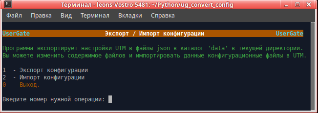

<h3>Экспорт/импорт конфигурации UTM UserGate (Версия 2.16)</h3>

Программа предназначена для переноса конфигурации с UTM версии 5 на версию 6 или между UTM 6-ой версии.

При экспорте создаются файлы в формате json с конфигурацией разделов.
Можно экспортировать настройки, затем внести необходимые изменения. Затем импортировать изменённые файлы конфигурации.

Скачать архив <b>ug_convert_config.zip</b>, распаковать, файл <b>ug_convert_config</b> сделать исполняемым. 
Запустить <b>ug_convert_config</b> в терминале. 
Программа работает в Ubuntu версии 20.04 LTS или выше. 
<b>Обращаем ваше внимание:</b> если вы запускаете данную программу в Ubuntu более старой версии или в другой
разновидности Linux, вы делаете это на свой страх и риск. Компания UserGate в этом случае ничем вам не может помочь.

Программа Запрашивает ip узла, login и пароль администратора UTM.

Для работы программы на интерфейсе Management в версии 5 необходимо включить сервис xml-rpc. На версии 6 этого
делать не надо, так как сервис xml-rpc на интерфейсе Management включён по умолчанию.
1. Открыть веб-консоль администратора таким образом: https://<usergate_ip>:8001/?features=zone-xml-rpc
2. В настройках нужной зоны активировать сервис "XML-RPC для управления".

Проверьте, что у администратора, логин которого используете, в профиле включены разрешения для API. 

Для полноценного переноса конфигурации (с сервисами, списками UsrGate, морфологией и другими разделами библиотеки)
необходимо перед началом работы на новой версии настроить DNS, интерфейс Untrusted (для выхода в интернет), шлюз,
произвести активацию корректным ПИН-кодом. После этого дождаться обновления библиотек и списков. 
Если у Вас в правилах используются доменные пользователи и группы, то при импорте необходимо в первую очередь
импортировать настройки DNS, затем список серверов авторизации LDAP. После этого ввести пароль в LDAP-коннекторе,
загрузить keytab-файл, если используется авторизация kerberos и проверить его работу. Затем можно выбрать "Импортировать всё".

<b>Примечания:</b>
1. Экспорт из правил и импорт доменных пользователей и групп в правила возможен только при использовании версии
UTM равной 5.0.6.4973 или выше, если экспорт производится из 5-ой версии и 6.1.3.10697 или выше для импорта и
экспорта. Если у вас версия 4825, поставьте update до версии 4973, который можно запросить в техподдержке UG.
<b>Не используйте версию 4973 для работы в боевом режиме. Она предназначена только для экспорта конфигурации и
последующего немедленного перехода на версию 6.</b>
2. Импорт доменных администраторов и доменных групп администраторов возможен только при использовании версии UTM 6.1.4.11000
или выше для импорта. 
3. Если вы делаете импорт не всей конфигурации, то необходимо учитывать, что разделы конфигурации взаимосвязаны друг
с другом. Поэтому импорт определённого пункта меню пройдёт без ошибок только если ранее был выполнен импорт
всех предыдущих пунктов этого меню и всех пунктов вышележащих меню.
4. После импорта профилей администраторов, необходимо проверить доступ к разделам, так как в версии 6 были добавлены
новые разделы. При импорте доступ к разделам не меняется и, следовательно, доступ к новым разделам не предоставляется.
5. Если существуют правила МЭ с одинаковыми именами, то при конвертации к имени такого правило добавляется номер,
что бы имена были уникальными.
6. Пробелы в начале и конце имён правил, списков и т.д. при конвертации удаляются.
7. Имена списков IP-адресов типа "10.10.10.0/24" заменяются на "10.10.10.0_24" так как при переносе каждый список
записывается в отдельный файл с данным именем, а в файловой системе Linux прямой слэш является разделителем пути к файлу.
8. После импорта настроек BGP в свойсвах каждого из bgp-соседей надо заново ввести пароль.
9. При импорте интерфейсов им прописываются IP-адреса из сохранённой конфигурации. Необходимо проследить, чтобы не было
конфликта IP-адресов. В общем случае можно в файле выгруженной конфигурации data/network/config_interfaces.json поменять
ip-адрес на каждом интерфейсе.
10. Раздел Библиотеки "Профили СОВ": не импортируются сигнатуры профилей СОВ с версии 5 на версию 6, так как
в 6-ой версии структура и состав сигнатур кардинально поменялись.
11. Сертификаты не переносятся. Если используется сертификат по умолчанию для SSL инспектирования (CA Default), то необходимо
обновить его у всех пользователей. Если вы используете собственные сертификаты, необходимо загрузить и сконфигурировать их заново.
12. Правила экспорта настроек на сервера FTP, SSH не переносятся. Это надо сделать руками.

09.02.2022  Исправлен экспорт правил NAT. 
02.02.2022  Исправлена обработка ошибок xmlrpc. 
27.01.2022  Исправлена ошибка при обработке IP-листов с пробелами в названии. 
28.12.2021  Добавлен расширенный вывод сообщений при импорте списков URL. 
08.12.2021  Исправлена ошибка обращения к неактивному LDAP-коннектору. 
07.12.2021  Сделана обработка ситуации, когда в правилах указан несуществующий сертификат. 
03.12.2021  Имена доменов AD сделаны нечувствительными к регистру. 
24.11.2021  Сделана обработка ситуации при импорте, когда списки обновляются через url. 
23.11.2021  Исправлен экспорт интерфейсов, если есть слоты расширения везде в разделе "Сеть". 
22.11.2021  Исправлен экспорт интерфейсов, если есть слоты расширения. 
16.11.2021  Исправлены ошибки, появляющиеся при экспорте экзотических конфигураций в некоторых случаях. 
12.11.2021  Исправлен импорт доменных администраторов UTM. 
11.11.2021  Добавлен экспорт/импорт изменённых категорий URL из раздела "Библиотеки". 
09.11.2021  Исправлен импорт балансировщиков ICAP. 
09.11.2021  Исправлен импорт настроек веб-портала. 
02.11.2021  Сделана обработка ошибки несуществующей зоны на выключенном интерфейсе. 
29.10.2021  Исправлена ошибка получения списка сертификатов. 
29.10.2021  Сделана обработка отсутствия прав на чтение раздела конфигурации. 
21.10.2021  Исправлена ошибка при экспорте доменных групп. 
15.10.2021  Улучшена поддержка сессии к UTM. 
15.10.2021  Сделаны проверки на добавление интерфейсов с несуществующими сетевыми адаптерами. 
15.10.2021  Исправлена ошибки при импорте зон, веб-портала и интерфейсов. 
13.10.2021  Доработан выход из программы. Теперь после отработки задания не происходит отключение от UTM и можно продолжать работу. 
14.09.2021  Добавлен экспорт/импорт правил оповещений и SNMP из раздела "Диагностика и мониторинг/Оповещения". 
13.09.2021  Добавлен экспорт/импорт настроек OSPF, BGP из раздела "Сеть". 
07.09.2021  Добавлен экспорт/импорт списка "Маршруты" из раздела "Сеть". 
07.09.2021  Исправлена выгрузка очень большого количества разных списков. 
02.09.2021  Добавлен экспорт/импорт списка "WCCP" из раздела "Сеть". 
02.09.2021  Исправлена выгрузка списка IP-адресов, содержащих "/" в имени списка. 
30.08.2021  Исправлена выгрузка сервисов раздела библиотеки. 
30.08.2021  Добавлен импорт интерфейсов bridge, pppoe, vlan, tunnel, vpn из раздела "Сеть". 
27.08.2021  Добавлен update сетевых адаптеров и импорт bond интерфейсов из раздела "Сеть". 
25.08.2021  Добавлен Экспорт списка "Интерфейсы" из раздела "Сеть". 
24.08.2021  Добавлен Экспорт/импорт списка "Шлюзы" из раздела "Сеть". 
24.08.2021  Добавлен Экспорт/импорт настроек "Проверка сети" из раздела "Сеть/Шлюзы". 
23.08.2021  Добавлен Экспорт/импорт списка администраторов UTM из раздела "UserGate/Администраторы". 
20.08.2021  Добавлен Экспорт/импорт настроек Веб-портала из раздела "UserGate/Настройки". 
20.08.2021  Добавлен Экспорт/импорт настроек паролей администраторов из раздела "UserGate/Администраторы". 
19.08.2021  Добавлен Экспорт/импорт списка "Серверные правила" из раздела "VPN". 
19.08.2021  Добавлен Экспорт/импорт списка "Клиентские правила" из раздела "VPN". 
19.08.2021  Добавлен Экспорт/импорт настроек интерфейса веб-консоли из раздела "UserGate/Настройки". 
19.08.2021  Добавлен Экспорт/импорт списка "Профили администраторов" из раздела "UserGate/Администраторы". 
18.08.2021  Добавлен Экспорт/импорт списка "Профили безопасности VPN" из раздела "VPN". 
18.08.2021  Добавлен Экспорт/импорт списка "Сети VPN" из раздела "VPN". 
17.08.2021  Добавлен Экспорт/импорт списка "Веб-портал" из раздела "Глобальный портал". 
17.08.2021  Добавлен Экспорт/импорт списка "Серверы reverse-прокси" из раздела "Глобальный портал". 
17.08.2021  Добавлен Экспорт/импорт списка "Правила reverse-прокси" из раздела "Глобальный портал". 
16.08.2021  Добавлен Экспорт/импорт списка "Профили DoS" из раздела "Политики безопасности". 
16.08.2021  Добавлен Экспорт/импорт списка "Правила защиты DoS" из раздела "Политики безопасности". 
12.08.2021  Добавлен Экспорт/импорт правил "СОВ" из раздела "Политики безопасности". 
12.08.2021  Добавлен Экспорт/импорт списка "Правила АСУ ТП" из раздела "Политики безопасности". 
13.08.2021  Добавлен Экспорт/импорт правил "Защита почтового трафика" из раздела "Политики безопасности". 
11.08.2021  Добавлен Экспорт/импорт правил "Веб-безопасность" из раздела "Политики безопасности". 
11.08.2021  Добавлен Экспорт/импорт правил "Инспектирование SSL" из раздела "Политики безопасности". 
11.08.2021  Добавлен Экспорт/импорт правил "Инспектирование SSH" из раздела "Политики безопасности". 
10.08.2021  Добавлен Экспорт/импорт правил "Фильтрация контента" из раздела "Политики безопасности". 
06.08.2021  Добавлен Экспорт/импорт списка "ICAP-серверы" из раздела "Политики безопасности". 
06.08.2021  Добавлен Экспорт/импорт списка "ICAP-правила" из раздела "Политики безопасности". 
09.08.2021  Добавлен Экспорт/импорт списка "Пропускная способность" из раздела "Политики сети". 
05.08.2021  Добавлен Экспорт/импорт правил "Балансировка нагрузки" из раздела "Политики сети". 
04.08.2021  Добавлен Экспорт/импорт правил "NAT и маршрутизация" из раздела "Политики сети". 
30.07.2021  Добавлен Экспорт/импорт Сценариев из раздела "Политики безопасности". 
30.07.2021  Добавлен Экспорт/импорт правил межсетевого экрана из раздела "Политики сети". 
27.07.2021  Добавлен Экспорт/импорт Политик BYOD из раздела "Пользователи и устройства". 
26.07.2021  Добавлен импорт доменных пользователей в локальные группы (при экспорте из 6-ой версии). 
20.07.2021  Добавлен экспорт/импорт правил Captive-портала из раздела "Пользователи и устройства". 
16.07.2021  Добавлен экспорт/импорт Captive-профилей из раздела "Пользователи и устройства". 
16.07.2021  Переделан импорт DHCP. 
15.07.2021  Добавлен экспорт/импорт профилей авторизации из раздела "Пользователи и устройства". 
14.07.2021  Добавлен экспорт/импорт профилей MFA из раздела "Пользователи и устройства". 
13.07.2021  Добавлен экспорт/импорт серверов авторизации из раздела "Пользователи и устройства". 
12.07.2021  Добавлен экспорт/импорт настроек DNS из раздела "Сеть". 
07.07.2021  Добавлен экспорт/импорт настроек NTP, модулей, кеширования HTTP из раздела "Настройки". 
06.07.2021  Добавлен экспорт/импорт локальных пользователей и групп. 
