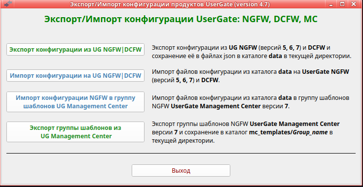
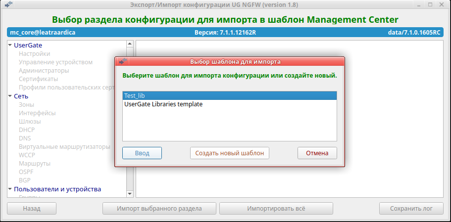

<h2 align="center">Экспорт/импорт конфигурации NGFW UserGate</h2>
<h3 align="center">(Версия 2.0)</h3>

Программа предназначена для переноса конфигурации с NGFW версий 5, 6 и 7 на NGFW версий 5, 6 и 7 и МС версии 7.1 и выше.

Программа работает в Ubuntu версии 24.04 или выше. 
<b>Обращаем ваше внимание:</b> если вы запускаете данную программу в Ubuntu более старой версии или в другой
разновидности Linux, вы делаете это на свой страх и риск. Компания UserGate в этом случае ничем вам не может помочь.

Для работы программы на зоне интерфейса, используемого для веб-косоли администратора, необходимо включить сервис xml-rpc.
Если используется зона Management, то это делать не надо, так как сервис xml-rpc на интерфейсе Management включён по умолчанию.
Исключением является версия 5. На ней необходимо включить данный сервис на зоне Management.
1. Открыть веб-консоль администратора таким образом: https://<usergate_ip>:8001/?features=zone-xml-rpc
2. В настройках нужной зоны активировать сервис "XML-RPC для управления".

<b>Экспорт конфигурации:</b>
1. Скачайте архив <b>ug_ngfw_converter.zip</b> и распакуйте его. Файл <b>ug_ngfw_converter</b> сделайте исполняемым. 
2. Запустите программу <b>ug_ngfw_converter</b>. Программа выполняется в графической среде. В текущей директории будет создан
каталог <b>data</b> для хранения всех выгруженных конфигураций. 
3. Выбрать пункт - <b>Экспорт конфигурации</b>. 
4. Далее программа попросит выбрать или ввести название каталога для экспорта конфигурации, затем появиться окно авторизации.
Проверьте, что у администратора, логин которого используете, в профиле включены разрешения для API. Укажите ip-адрес NGFW и
login/пароль администратора. 
5. Можно экспортировать всю конфигурацию, только выбранную группу разделов или отдельный раздел. 
6. После экспорта проверьте вывод программы на предмет обнаруженных ошибок. Исправьте текущую конфигурацию NGFW и повторите экспорт. 
7. Можно сохранить лог в файл export.log. Файл создаётся в выбранном каталоге экспорта конфигурации. 

<b>Импорт конфигурации на NGFW:</b>
1. Перед началом работы на новой версии UserGate NGFW настроить DNS, интерфейс Untrusted (для выхода в интернет),
шлюз, произвести активацию корректным ПИН-кодом. После этого дождаться обновления библиотек и списков. 
2. Запустить программу <b>ug_ngfw_converter</b>. 
3. Выбрать пункт 2 - <b>Импорт конфигурации на NGFW</b>. 
4. Программа попросит выбрать каталог для импорта конфигурации, затем появиться окно авторизации.
<b>Проверьте, что у администратора, логин которого используете, в профиле включены все разрешения для API.</b> Укажите ip-адрес NGFW и
login/пароль администратора. 
5. Можно импортировать всю конфигурацию, только выбранную группу разделов или отдельный раздел. 
6. Если у вас используются собственные сертификаты, то перед импортом необходимо импортировать их или создать с теми же именами. 
7. Если у Вас используются сервера аутентификации (LDAP, NTLM, RADIUS, TACACS, SAML), то необходимо в первую очередь импортировать
настройки DNS, затем используемые сервера аутентификации и профили аутентификации. После этого ввести пароль в серверах аутентификации,
загрузить keytab-файл, если используется авторизация kerberos и проверить работу данных серверов аутентификации. 
8. Импорт некоторых разделов конфигурации может идти долго. Не надо думать что "программа зависла". Надо дождаться окончания импорта. 
9. После импорта проверьте вывод программы на наличие сообщений, выделенных цветом. Исправьте конфигурацию NGFW в соответствие
с рекомендациями. 

<b>Импорт конфигурации в шаблон Management Center</b>
1. В настоящее время при импорте объектов в библиотеку на МС версии 7 не учитывается регистр символов. То есть одинаковые
имена в разных регистрах считаются одинаковыми! МС выдаёт сообщение, что такой объект уже существует и не импортирует его.
Данное поведение будет исправлено в версии МС 7.1.3.
2. В списках морфологии слова добавляются не корректно. К слову добавляется его вес через символ табуляции. Это не ошибка
конвертера, а баг МС. Возможно будет исправлен в версии МС 7.1.2.
3. Если у вас используются сервера аутентификации LDAP, то необходимо настроить LDAP-коннектор в разделе
"Управление областью/Каталоги пользователей" и проверить его работу. Данный LDAP-коннектор будет использоваться для поиска
доменных пользователей и групп в правилах.
4. Перед импортом убедитесь, что в шаблоне МС существуют необходимые интерфейсы и зоны. Они необходимы для создания VLAN и
subnet DHCP. Если нет интерфейсов, то VLAN и subnet DHCP не будут созданы. Рекомендуется в первую очередь импортировать зоны,
затем создать необходимые интерфейсы для будущих VLAN и subnet DHCP и только затем импортировать всё.
5. При импорте сертификатов, если в каталоге сертификата присутствует приватный ключ (key.pem или key.der), то он
импортируется вместе с сертификатом. Если в каталоге нет файлов cert.pem и cert.der, то генерируется новый сетрификат на
основе информации файла certificate_list вместе с приватным ключём.
6. После импорта раздела UserGate/Настройки, включите синхронизацию необходимых подразделов.
7. В настоящее время реализован только импорт разделов: Библиотеки, Сеть, UserGate. Импорт остальных разделов ещё в процессе.

<b>Ограничения:</b>
1. Экспортируются настройки всех интерфесов, но импортируются только интерфейсы VLAN и Tunnel. Все остальные надо будет сделать руками. 
2. На всех версиях (кроме 5) нельзя добавить более 8 полос пропускания в библиотеку. При добавлении большего количества
получим ошибку. 
3. Для версии 5: 
3.1. Если вы делаете экспорт из версии 5, то выгрузка из правил доменных пользователей и доменных групп для дальнейшего переноса
возможна только при использовании версии UTM равной 5.0.6.4973. Если у вас версия 4825, поставьте update до версии 4973,
который можно запросить в техподдержке UG. 
<b>Не используйте версию 4973 для работы в боевом режиме. Она предназначена только для экспорта конфигурации.</b> 
3.2. При экспорте Captive-профилей, не экспортируются дата и время окончания регистрации гостевых пользователей. 
3.3. Нельзя сделать экспорт/импорт терминальных серверов. 
3.4. На версию 5 не импортируются VLAN-ы, Маршруты, OSPF, BGP. 
3.5. При импорте с версий 7.0 и выше не переносятся группы сервисов, так как в версии 5 группы сервисов не поддерживаются. 
3.6. На версию 5 не возможно импортировать содержимое календарей. Содержимое надо добавить руками. 
3.7. На версию 5 не возможно импортировать содержимое URL категорий. Содержимое надо добавить руками. 
3.8. Импорт профилей СОВ на версию 5 не поддерживается. 
3.9. При импорте правил SNMP с версии 7.1, правила v.3 импортируются как v.2 
4. Для версии 6: 
4.1. Конвертер не работает с UG NGFW версии 6 если она старее 6.1.7. В этом случае обновитесь до последней версии 6. 
4.2. При импорте с версий 7.0 и выше не переносятся группы сервисов, так как в версии 6 группы сервисов не поддерживаются. 
4.3. Импорт профилей СОВ версии 7.1 и выше на версию 6 не поддерживается. 
4.4. При импорте правил SNMP с версии 7.1, правила v.3 импортируются как v.2 
5. Для версии 7.0: 
5.1. При импорте с более старых версий в правила не переносятся отдельные приложения т.к. в этой версии разрешены только
группы приложений и категории приложений. 
5.2. Импорт профилей СОВ версии 7.1 и выше на версию 7.0 не поддерживается. 
5.3. При импорте правил SNMP с версии 7.1, правила v.3 импортируются как v.2 
6. Для версии 7.1: 
6.1. При импорте с более старых версий в правила не переносятся приложения, группы приложений и категории приложений т.к.
в этой версии используются профили приложенй. 
6.2. Импорт профилей СОВ более старых версии не поддерживается. 
6.3. При импорте правил SNMP с более старых версий, правила v.3 импортируются как v.2 

<b>Примечание:</b>
1. Если вы импортируете конфигурацию на версию 7, то имена групп, серверов аутентификации, различных профилей, правил,
всех списков библиотеки и всего-всего должны быть ТОЛЬКО в английском регистре. Русские буквы допустимы только в описании.
Перед экспортом, замените русские символы в именах на английские. 
2. Начиная с версии 7.1 в именах запрещены многие спец.символы. При экспорте с любой версии будет произведено их удаление. 
3. После импорта профилей администраторов, необходимо проверить доступ к разделам, так как в версии 6 и 7 были добавлены
новые разделы. При импорте доступ к разделам не меняется и, следовательно, доступ к новым разделам не предоставляется.
Профили с русскими именами не переносятся в версию 7 (в ней запрещены русские имена). Перед экспортом, замените имена
профилей на английские. 
4. Если существуют правила МЭ с одинаковыми именами, то при конвертации к имени такого правило добавляется номер,
что бы имена были уникальными. 
5. Пробелы в начале и конце имён правил, списков и т.д. при конвертации удаляются. 
6. При экспорте списков IP-адресов типа "10.10.10.0/24" такой список сохраняется в файл "10.10.10.0_24" так как при переносе
каждый список записывается в отдельный файл, а в файловой системе Linux прямой слэш является разделителем пути к файлу.
Имя самого списка не меняется. 
7. После импорта настроек BGP в свойсвах каждого из bgp-соседей надо заново ввести пароль. 
8. Никакие пароли (локальных пользователей, PPPoE, VPN, серверов аутентификации и т.д.) не переносятся. Необходимо
заново вручную ввести пароль. Это ограничение API - невозможно выгрузить парольную информацию. 
9. При импорте интерфейсов VLAN им прописываются IP-адреса из сохранённой конфигурации. Необходимо проследить, чтобы не было
конфликта IP-адресов. В общем случае можно в файле выгруженной конфигурации data/Network/Interfaces/config_interfaces.json поменять
ip-адрес на каждом интерфейсе. 
10. Раздел Библиотеки "Профили СОВ" для версий меньше 7.1: не импортируются сигнатуры профилей СОВ так как в разных версиях
структура и состав сигнатур кардинально меняется. Для версии 7.1 и выше экспортируются/импортируются пользовательские сигнатуры. 
11. Сертификаты экспортируются, но пока не импортируются. Если используется сертификат по умолчанию для SSL инспектирования
(CA Default), то необходимо обновить его у всех пользователей. Если вы используете собственные сертификаты, необходимо загрузить
и сконфигурировать их заново. 
12. Правила экспорта настроек на сервера FTP, SSH пока не переносятся. Это надо сделать руками. 
13. При экспорте шаблонов страниц библиотеки выгружается файл HTML только изменённых страниц шаблона. 
14. Если вы обнаружили ошибку в програме или у вас что то не получается, пожалуйста, откройте тикет в тех.поддержку компании UserGate. 

<b>Errors:</b>
На ПК с видеокартами NVIDIA возможна ошибка: "libEGL warning: failed to create dri2 screen" 
В этом случае необходимо:
1. sudo apt-get install libnvidia-egl-wayland1 
2. Перезагрузить компьютер. 

На виртуальных машинах возможна ошибка: "libEGL.so.1: cannot open shared object file: No such file or directory" 
Может помочь: apt update && apt install -y libopencv-dev && apt clean && rm -rf /var/lib/apt/lists/*

20.08.2024 Реализован импорт раздела "UserGate" в шаблон МС. 
14.08.2024 Реализован импорт раздела "Сеть" в шаблон МС. 
12.08.2024 Реализован импорт раздела "Библиотеки" в шаблон МС. 
08.06.2024 Исправлен экспорт правил reverse-прокси 
17.05.2024 Исправлена импорт списков IP-адресов в настройках зон для NGFW версии 7.1 
08.04.2024 Сделана совместимость с релизом NGFW версии 7.1.0 
20.03.2024 Исправлен экспорт шлюзов если они ранее были получены с МС. 
14.03.2024 Исправлен импорт календарей для версии NGFW 7.1.0.1672R 
