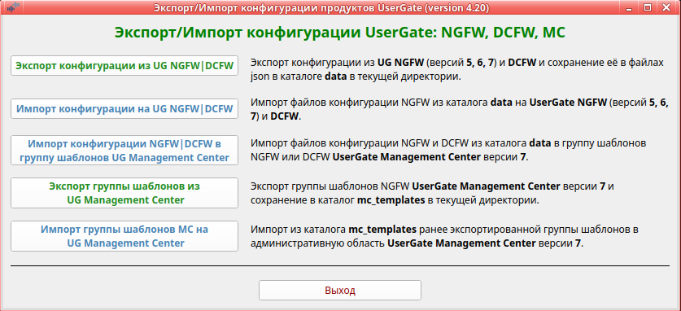

<h2 align="center">Экспорт/импорт конфигурации NGFW UserGate</h2>
<h3 align="center">(Версия 4.5)</h3>

Программа предназначена для переноса конфигурации с NGFW версий 5, 6, 7, 8 на NGFW версий 5, 6, 7, 8 и МС версии 7.1 и выше.

Программа работает в Ubuntu версии 24.04 или выше. 
<b>Обращаем ваше внимание:</b> если вы запускаете данную программу в Ubuntu более старой версии или в другой
разновидности Linux, вы делаете это на свой страх и риск. Компания UserGate в этом случае ничем вам не может помочь.

Для работы программы на зоне интерфейса, используемого для веб-косоли администратора, необходимо включить сервис xml-rpc.
Если используется зона Management, то это делать не надо, так как сервис xml-rpc на интерфейсе Management включён по умолчанию.
Исключением является версия 5. На ней необходимо включить данный сервис на зоне Management.
1. Открыть веб-консоль администратора таким образом: https://<usergate_ip>:8001/?features=zone-xml-rpc
2. В настройках нужной зоны активировать сервис "XML-RPC для управления".

<b>Экспорт конфигурации из UG NGFW:</b>
1. Скачайте архив <b>ug_ngfw_converter.zip</b> и распакуйте его. Файл <b>ug_ngfw_converter</b> сделайте исполняемым. 
2. Запустите программу <b>ug_ngfw_converter</b>. Программа выполняется в графической среде. В текущей директории будет создан
каталог <b>data</b> для хранения всех выгруженных конфигураций. 
3. Выбрать пункт - <b>Экспорт конфигурации из UG NGFW</b>. 
4. Далее программа попросит выбрать или ввести название каталога для экспорта конфигурации, затем появиться окно авторизации.
Проверьте, что у администратора, логин которого используете, в профиле включены разрешения для API. Укажите ip-адрес NGFW и
login/пароль администратора. 
5. Можно экспортировать всю конфигурацию, только выбранную группу разделов или отдельный раздел. 
6. После экспорта проверьте вывод программы на предмет обнаруженных ошибок. Исправьте текущую конфигурацию NGFW и повторите экспорт. 
7. Можно сохранить лог в файл export.log. Файл создаётся в выбранном каталоге экспорта конфигурации. 

<b>Импорт конфигурации на NGFW:</b>
1. Перед началом работы на новой версии UserGate NGFW настроить DNS, интерфейс Untrusted (для выхода в интернет),
шлюз, произвести активацию корректным ПИН-кодом. После этого дождаться обновления библиотек и списков. 
2. Запустить программу <b>ug_ngfw_converter</b>. 
3. Выбрать пункт 2 - <b>Импорт конфигурации на UG NGFW</b>. 
4. Программа попросит выбрать каталог для импорта конфигурации, затем появиться окно авторизации.
<b>Проверьте, что у администратора, логин которого используете, в профиле включены все разрешения для API.</b> Укажите ip-адрес NGFW и
login/пароль администратора. 
5. Можно импортировать всю конфигурацию, только выбранную группу разделов или отдельный раздел. 
6. Если у вас используются собственные сертификаты, то перед импортом необходимо импортировать их или создать с теми же именами. 
7. Если у Вас используются сервера аутентификации (LDAP, NTLM, RADIUS, TACACS, SAML), то необходимо в первую очередь импортировать
настройки DNS, затем используемые сервера аутентификации и профили аутентификации. После этого ввести пароль в серверах аутентификации,
загрузить keytab-файл, если используется авторизация kerberos и проверить работу данных серверов аутентификации. 
8. Если вы импортируете конфигурацию на NGFW версии 7.1 и выше с NGFW версий 5, 6 и 7.0, не импортируются Серверные и Клиентские
профили безопасности VPN. Так как в этих версиях таких профилей безопасности нет. Старые профили перенести нельзя, так как в
последних версиях профили безопасности сильно изменились. Необходимо сделать соответствующие профили руками (с именами, которые
используются в серверных и клиентских правилах) и затем импортировать правила. 
9. Импорт некоторых разделов конфигурации может идти долго. Не надо думать что "программа зависла". Надо дождаться окончания импорта. 
10. После импорта проверьте вывод программы на наличие сообщений, выделенных цветом. Исправьте конфигурацию NGFW в соответствие
с рекомендациями. 

<b>Экспорт конфигурации из шаблона UG MC:</b>
1. В настоящее время это ещё находиться в разработке.

<b>Импорт конфигурации в группу шаблонов Management Center</b>
1. Перед импортом в области надо создать группу шаблонов и поместить в неё необходимые шаблоны. Так как основной смысл
шаблонов и групп шаблонов в переиспользовании объектов, хорошей практикой является отсутствие дублирования объектов в
одинаковых разделах конфигурации шаблонов в группе шаблонов. В соответствии с этим принципом, конвертер проверяет наличие дублирования
объектов во всех шаблонах группы шаблонов. При обнаружении объектов с совпадающими именами в одинаковых разделах конфигурации
выводится предупреждение и для импорта будет использован первый найденный объект. Это может привести не к тому результату,
который вы ожидаете. Поэтому, пожалуйста, соблюдайте правило: один объект определённого раздела конфигурации на всю группу
шаблонов. Кроме того, это в будущем облегчит работу с шаблонами и группами шаблонов.
2. Перед импортом каждого объекта происходит поиск по его имени во всех шаблонах указанной группы шаблонов. Если такой
объект найден в каком то из шаблонов, то он не импортируется. При этом выдаётся соответствующее сообщение с указанием
шаблона в котором объект присутствует. Шаблоны их других групп не проверяются. Это относится к объектам библиотеки, некоторым
объектам раздела "Сеть" и другим объектам, которые являются общими для различных правил.
3. В версиях меньше чем МС 7.2.0 при импорте объектов не учитывается регистр символов. То есть одинаковые имена в разных
регистрах считаются одинаковыми! МС выдаёт сообщение, что такой объект уже существует и не импортирует его. 
4. В списках морфологии слова добавляются не корректно. К слову добавляется его вес через символ табуляции. Это не ошибка
конвертера, а баг МС. Будет исправлен в версии МС 7.3. 
5. Если у вас используются сервера аутентификации LDAP, то необходимо настроить LDAP-коннектор в разделе
"Управление областью/Каталоги пользователей" и проверить его работу. Данный LDAP-коннектор будет использоваться для поиска
доменных пользователей и групп в правилах. 
6. Если вы не используете режим "Импортировать всё", а импортируете отдельные пункты раздела "Сеть", перед импортом убедитесь, что в
группе шаблонов существуют необходимые интерфейсы и зоны. Они необходимы для создания subnet DHCP и VRF. Если нет интерфейсов,
то subnet DHCP не будут созданы, а в VRF настройки OSPF и RIP будут не полными. В этом случае рекомендуется в первую очередь
импортировать зоны, затем создать необходимые интерфейсы для будущих subnet DHCP и VRF (или сделать импорт интерфейсов) и только
затем импортировать остальные пункты раздела "Сеть". 
7. При импорте сертификатов, если в каталоге сертификата присутствует приватный ключ (key.pem или key.der), то он
импортируется вместе с сертификатом. Если в каталоге нет файлов cert.pem и cert.der, то генерируется новый сертификат вместе
с приватным ключём на основе информации файла certificate_list. 
8. После импорта раздела UserGate/Настройки, включите синхронизацию необходимых подразделов. 
9. Если при импорте правил в шаблон МС произошли ошибки, то данное правило становиться не активным и в описание правила
добавляются сообщения о произошедших ошибках. После импорта проверьте все не активные правила на предмет ошибок импорта. 
10. Правила МЭ, КФ и т.д. добавляются в конец списка правил. Это надо учитывать если вы повторно импортируете конфигурацию
в шаблон после изменений в файлах json. Не меняйте имена правил, иначе правила продублируются в конец списка правил. 
11. Импорт свойств агента UserID не пройдёт, если вы экспортировали их конвертером версии 3.1 и ниже. 
12. Пока НЕ ИМПОРТИРУЕТСЯ раздел "Библиотеки/Syslog фильтры агента UserID" - так как пока не работает соответсвующий API. 
13. Если вы импортируете конфигурацию на MC с NGFW версий 5, 6 и 7.0, не импортируются Серверные и Клиентские
профили безопасности VPN. Так как в этих версиях таких профилей безопасности нет. Старые профили перенести нельзя, так как в
последних версиях профили безопасности сильно изменились. Необходимо сделать соответствующие профили руками (с именами, которые
используются в серверных и клиентских правилах) и затем импортировать правила. 

<b>Ограничения:</b>
1. Экспортируются настройки всех интерфесов, но на NGFW импортируются только интерфейсы VLAN и Tunnel. Все остальные надо будет
сделать руками. В шаблоны МС импортируются все интерфейсы. 
2. На версиях 6 и меньше 7.1.1 нельзя добавить более 8 полос пропускания в библиотеку. При добавлении большего количества
получим ошибку. 
3. На NGFW настройки VRF в кластерной конфигурации не импортируются. 
4. Для версии 5: 
4.1. Если вы делаете экспорт из версии 5, то выгрузка из правил доменных пользователей и доменных групп для дальнейшего переноса
возможна только при использовании версии UTM равной 5.0.6.4973. Если у вас версия 4825, поставьте update до версии 4973,
который можно запросить в техподдержке UG. 
<b>Не используйте версию 4973 для работы в боевом режиме. Она предназначена только для экспорта конфигурации.</b> 
4.2. При экспорте Captive-профилей, не экспортируются дата и время окончания регистрации гостевых пользователей. 
4.3. Нельзя сделать экспорт/импорт терминальных серверов. 
4.4. На версию 5 не импортируются VLAN-ы, Маршруты, OSPF, BGP. 
4.5. При импорте с версий 7.0 и выше не переносятся группы сервисов, так как в версии 5 группы сервисов не поддерживаются. 
4.6. На версию 5 не возможно импортировать содержимое календарей. Содержимое надо добавить руками. 
4.7. На версию 5 не возможно импортировать содержимое URL категорий. Содержимое надо добавить руками. 
4.8. Импорт профилей СОВ на версию 5 не поддерживается. 
4.9. При импорте правил SNMP с версии 7.1, правила v.3 импортируются как v.2 
5. Для версии 6: 
5.1. Конвертер не работает с UG NGFW версии 6 если она старее 6.1.7. В этом случае обновитесь до последней версии 6. 
5.2. При импорте с версий 7.0 и выше не переносятся группы сервисов, так как в версии 6 группы сервисов не поддерживаются. 
5.3. Импорт профилей СОВ версии 7.1 и выше на версию 6 не поддерживается. 
5.4. При импорте правил SNMP с версии 7.1, правила v.3 импортируются как v.2 
6. Для версии 7.0: 
6.1. При импорте с более старых версий в правила не переносятся отдельные приложения т.к. в этой версии разрешены только
группы приложений и категории приложений. 
6.2. Импорт профилей СОВ версии 7.1 и выше на версию 7.0 не поддерживается. 
6.3. При импорте правил SNMP с версии 7.1, правила v.3 импортируются как v.2 
7. Для версии 7.1: 
7.1. При импорте с более старых версий в правила не переносятся приложения, группы приложений и категории приложений т.к.
в этой версии используются профили приложенй. 
7.2. Импорт профилей СОВ более старых версии не поддерживается. 
7.3. При импорте правил SNMP с более старых версий, правила v.3 импортируются как v.2 
8. Для версии 8.0: 
8.1. В библиотеку не импортируются HIP объекты и HIP профили. 

<b>Примечание:</b>
1. Если вы импортируете конфигурацию на версию 7, то имена групп, серверов аутентификации, различных профилей, правил,
всех списков библиотеки и всего-всего должны быть ТОЛЬКО в английском регистре. Русские буквы допустимы только в описании.
Перед экспортом, замените русские символы в именах на английские. 
2. Начиная с версии 7.1 в именах запрещены многие спец.символы. При экспорте с любой версии будет произведено их удаление. 
3. Имена всех объектов не должны превышать длину в 64 символа. Если имя содержит более 64 символов, то такой объект не импортируется. 
4. После импорта профилей администраторов, необходимо проверить доступ к разделам, так как в версии 6 и 7 были добавлены
новые разделы. При импорте доступ к разделам не меняется и, следовательно, доступ к новым разделам не предоставляется.
Профили с русскими именами не переносятся в версию 7 (в ней запрещены русские имена). Перед экспортом, замените имена
профилей на английские. 
5. Если существуют правила МЭ с одинаковыми именами, то при конвертации к имени такого правило добавляется номер,
что бы имена были уникальными. 
6. Пробелы в начале и конце имён правил, списков и т.д. при конвертации удаляются. 
7. При экспорте списков IP-адресов типа "10.10.10.0/24" такой список сохраняется в файл "10.10.10.0_24" так как при переносе
каждый список записывается в отдельный файл, а в файловой системе Linux прямой слэш является разделителем пути к файлу.
Имя самого списка не меняется. 
8. После импорта настроек BGP в свойсвах каждого из bgp-соседей надо заново ввести пароль. 
9. Если вы сделали экспорт с кластера NGFW, то в файле конфигурации будут настройки VRF с каждого узла кластера с одинаковыми именами.
В этом случае VRF с дублирующими именами не будут импортированы. Конвертер не поддерживает кластерную конфигурацию при импорте. 
9. Никакие пароли (локальных пользователей, PPPoE, VPN, серверов аутентификации и т.д.) не переносятся. Необходимо
заново вручную ввести пароль. Это ограничение API - невозможно выгрузить парольную информацию. 
10. При импорте интерфейсов VLAN им прописываются IP-адреса из сохранённой конфигурации. Необходимо проследить, чтобы не было
конфликта IP-адресов. В общем случае можно в файле выгруженной конфигурации data/Network/Interfaces/config_interfaces.json поменять
ip-адрес на каждом интерфейсе. 
11. Раздел Библиотеки "Профили СОВ" для версий меньше 7.1: не импортируются сигнатуры профилей СОВ так как в разных версиях
структура и состав сигнатур кардинально меняется. Для версии 7.1 и выше экспортируются/импортируются пользовательские сигнатуры. 
12. Сертификаты экспортируются, но импорт возможен только в шаблон МС. На NGFW пока импорт не реализован. Если используется сертификат по умолчанию для SSL инспектирования
(CA Default), то необходимо обновить его у всех пользователей. Если вы используете собственные сертификаты, необходимо загрузить
и сконфигурировать их заново. 
13. Правила экспорта настроек на сервера FTP, SSH пока не переносятся. Это надо сделать руками. 
14. При экспорте шаблонов страниц библиотеки выгружается файл HTML только изменённых страниц шаблона. 
15. При импорте, правила МЭ, КФ и т.д. добавляются в конец списка правил. Если правило уже существует, то оно обновляется и его
порядковый номер не меняется. Это надо учитывать, если вы повторно импортируете конфигурацию после изменения в файлах json.
Не меняйте имена правил, иначе правила продублируются в конец списка правил.
16. Если при импорте правил произошли ошибки, то данное правило становиться не активным и в описание правила добавляются
сообщения о произошедших ошибках. После импорта проверьте все не активные правила на предмет ошибок импорта.
17. <b>Если вы обнаружили ошибку в програме или у вас что то не получается, пожалуйста, откройте тикет в тех.поддержку компании UserGate.</b> 

<b>Errors:</b>
1. На ПК с видеокартами NVIDIA возможна ошибка: "libEGL warning: failed to create dri2 screen" 
В этом случае необходимо:
    1. sudo apt-get install libnvidia-egl-wayland1 
    2. Перезагрузить компьютер. 

2. На виртуальных машинах возможна ошибка: "libEGL.so.1: cannot open shared object file: No such file or directory" 
Может помочь: <b>apt update && apt install -y libopencv-dev && apt clean && rm -rf /var/lib/apt/lists/*</b>

16.12.2024 Доработан импорт зон в группу шаблонов МС. 
13.12.2024 Доработан импорт зон на NGFW. 
12.12.2024 Добавлен импорт интерфейсов VPN на NGFW. 
11.12.2024 Исправлены ошибки импорта OSPF в виртуальных маршрутизаторах. 
10.12.2024 Исправлены ошибки импорта на NGFW групп пользователей в правилах. 
10.12.2024 Доработано GUI выбора шаблонов в группе шаблонов МС. Теперь при смене шаблона не надо заново логиниться на МС. 
03.12.2024 Сделана поддержка импорта в группу шаблонов МС. 
03.12.2024 Исправлены ошибки экспорта из NGFW. 
02.12.2024 Исправлен экспорт правил из раздела NAT и маршрутизация (сделана обработка ошибок конфигурации). 
01.11.2024 Добавлена совместимость с версией 8. 
15.10.2024 Исправлен экспорт сертификатов. 
08.10.2024 Сделан учёт лицензии на модуль WAF. 
07.10.2024 Исправлен импорт зон. 
06.10.2024 Исправлен экспорт/импорт правил reverse-прокси. 
04.10.2024 Исправлен экспорт из NGFW. При пустых временных полях в правилах. 
12.09.2024 Реализован импорт всех разделов конфигурации в шаблон МС. 
11.09.2024 Реализован импорт разделов "Глобальный портал" и "VPN" в шаблон МС. 
28.08.2024 Реализован импорт раздела "Политики безопасности" в шаблон МС. 
28.08.2024 Реализован импорт раздела "Политики сети" в шаблон МС. 
27.08.2024 Реализован импорт раздела "Пользователи и устройства" в шаблон МС. 
20.08.2024 Реализован импорт раздела "UserGate" в шаблон МС. 
14.08.2024 Реализован импорт раздела "Сеть" в шаблон МС. 
12.08.2024 Реализован импорт раздела "Библиотеки" в шаблон МС. 
08.06.2024 Исправлен экспорт правил reverse-прокси 
17.05.2024 Исправлена импорт списков IP-адресов в настройках зон для NGFW версии 7.1 
08.04.2024 Сделана совместимость с релизом NGFW версии 7.1.0 
20.03.2024 Исправлен экспорт шлюзов если они ранее были получены с МС. 
14.03.2024 Исправлен импорт календарей для версии NGFW 7.1.0.1672R 
