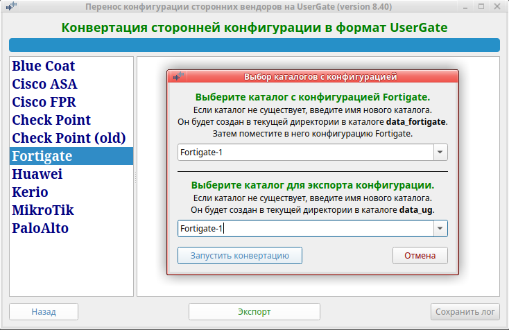

<h2 align="center">Перенос конфигурации сторонних вендоров на UserGate NGFW, DCFW и MC</h2>
<h3 align="center">(Версия 8.4)</h3>

Программа предназначена для переноса конфигурации с Blue Coat, Cisco ASA, Cisco FPR, Check Point, Fortigate, Huawei, MikroTik на NGFW
(версий 5, 6, 7), DCFW и Management Center версии 7.1 и выше.

Программа работает в Ubuntu версии 24.04 или выше. 
<b>Обращаем ваше внимание:</b> если вы запускаете данную программу в Ubuntu более старой версии или в другой
разновидности Linux, вы делаете это на свой страх и риск. Компания UserGate в этом случае ничем вам не может помочь.

Для работы программы на зоне интерфейса, используемого для веб-косоли администратора, необходимо включить сервис xml-rpc.
Если используется зона Management, то это делать не надо, так как сервис xml-rpc на интерфейсе Management включён по умолчанию.
Исключением является версия 5. На ней необходимо включить данный сервис на зоне Management.
1. Открыть веб-консоль администратора таким образом: https://<usergate_ip>:8001/?features=zone-xml-rpc
2. В настройках нужной зоны активировать сервис "XML-RPC для управления".

<b>Архив universal_converter.zip с исполняемым файлом доступен здесь:</b> https://docs.usergate.com/722/#universal6nyj-konverter

<b>Экспорт конфигурации:</b> 
1. Скачайте архив <b>universal_converter.zip</b> и распакуйте его. Файл <b>universal_converter</b> сделайте исполняемым. 
2. Запустите программу <b>universal_converter</b>. Программа выполняется в графической среде. В текущей директории будут созданы
каталоги для хранения всех выгруженных конфигураций и каталоги для конфигураций всех вендоров. 
3. Выбрать пункт - <b>Экспорт конфигурации</b>. 
4. Далее выберите вердора, конфигурацию которого экспортируете, и нажмите кнопку "Экспорт". 
5. Появиться окно, в котором необходимо указать каталог для экспортируемой конфигурации и каталог, куда будут помещены файлы
экспортированной конфигурации в формате UserGate NGFW. После этого данные каталоги будут созданы. 
6. После экспорта проверьте вывод программы на предмет обнаруженных ошибок. 
7. Можно сохранить лог экспорта в файл export.log. Файл создаётся в выбранном каталоге экспорта конфигурации. 
8. <b>Для Blue Coat:</b> 
8.1. Переименуйте файл конфигурации Blue Coat в <b>bluecoat.cfg</b> и скопируйте его в каталог data_blue_coat/<i><имя_которое_вы_задали_на_предыдущем_шаге></i> 
9. <b>Для Cisco ASA:</b> 
9.1. Переименуйте файл конфигурации Cisco ASA в <b>cisco_asa.cfg</b> и скопируйте его в каталог data_cisco_asa/<i><имя_которое_вы_задали_на_предыдущем_шаге></i> 
10. <b>Для Cisco FPR:</b> 
10.1. Переименуйте файл конфигурации Cisco FPR в <b>cisco_fpr.cfg</b> и скопируйте его в каталог data_cisco_fpr/<i><имя_которое_вы_задали_на_предыдущем_шаге></i> 
11. <b>Для Check Point:</b> 
11.1. Выгрузите конфигурацию Check Point <b>show package</b> 
11.2. Разархивируйте полученный файл и скопируйте все файлы в каталог data_checkpoint/<i><имя_которое_вы_задали_на_предыдущем_шаге></i>. 
11.3. Запустите на CheckPoint команду <b>save configuration config_cp.txt</b> 
11.4. Файл <b>config_cp.txt</b> поместите в тот же каталог: data_checkpoint/<i><имя_которое_вы_задали_на_предыдущем_шаге></i>. 
12. <b>Для Fortigate:</b> 
12.1. Переименуйте файл конфигурации Fortigate в <b>fortigate.cfg</b> и скопируйте его в каталог data_fortigate/<i><имя_которое_вы_задали_на_предыдущем_шаге></i> 
13. <b>Для Huawei:</b> 
13.1. Переименуйте файл конфигурации Huawei в <b>huawei.cfg</b> и скопируйте его в каталог data_huawei/<i><имя_которое_вы_задали_на_предыдущем_шаге></i> 
14. <b>Для MikroTik:</b> 
14.1. Переименуйте файл конфигурации MikroTic в <b>mikrotik.cfg</b> и скопируйте его в каталог data_mikrotik/<i><имя_которое_вы_задали_на_предыдущем_шаге></i> 

<b>Импорт конфигурации:</b>
1. Можно импортировать всю конфигурацию, только выбранную группу разделов или отдельный раздел. Если вы не импортируете всё сразу
в пакетном режиме, сначала импортируйте содержимое библиотеки, локальных пользователей и группы пользователей и только затем
нужные разделы конфигурации. 
2. Если у вас используются собственные сертификаты, то перед импортом необходимо импортировать их или создать с теми же именами. 
3. После импорта проверьте вывод программы на наличие сообщений, выделенных цветом. Исправьте конфигурацию в соответствие
с рекомендациями. 
4. Можно сохранить лог импорта в файл import.log. Файл создаётся в выбранном каталоге импорта конфигурации. 

<b>Импорт конфигурации на UserGate NGFW и DCFW:</b> 
1. Перед началом работы на новой версии UserGate NGFW или DCFW необходимо настроить DNS, интерфейс Untrusted (для выхода в интернет),
шлюз, произвести активацию корректным ПИН-кодом. После этого дождаться обновления библиотек и списков. 
2. Запустить программу <b>universal_converter</b>. 
3. Выбрать пункт - <b>Импорт конфигурации на UG NGFW|DCFW</b>. 
4. Программа попросит выбрать каталог для импорта конфигурации, затем появиться окно авторизации.
<b>Проверьте, что у администратора, логин которого используете, в профиле включены все разрешения для API.</b> Укажите
ip-адрес NGFW/DCFW и login/пароль администратора. 
5. Можно импортировать всю конфигурацию, только выбранную группу разделов или отдельный раздел. 
6. Перед импортом убедитесь, что в на NGFW/DCFW существуют необходимые зоны зоны. Они необходимы для корректного создания VLAN, subnet DHCP
и VRF. Рекомендуется в первую очередь импортировать зоны, и только затем импортировать всё. 
7. Если у Вас используются сервера аутентификации (LDAP, NTLM, RADIUS, TACACS, SAML), то необходимо в первую очередь импортировать
настройки DNS, затем используемые сервера аутентификации и профили аутентификации. После этого ввести пароль в серверах аутентификации,
загрузить keytab-файл, если используется авторизация kerberos и проверить работу данных серверов аутентификации. 
8. Импорт некоторых разделов конфигурации может идти долго. Не надо думать что "программа зависла". Надо дождаться окончания импорта. 
9. <b>Импорт на версию UG NGFW 5:</b> 
9.1. На версию 5 не импортируются VLAN-ы, Маршруты, OSPF, BGP. 
9.2. При импорте не переносятся группы сервисов и IP-адресов, так как в версии 5 группы не поддерживаются. 
9.3. На версию 5 не возможно импортировать содержимое календарей. Содержимое надо добавить руками. 
9.4. На версию 5 не возможно импортировать содержимое URL категорий. Содержимое надо добавить руками. 
10. <b>Импорт на версию UG NGFW 6:</b> 
10.1. Конвертер не работает с UG NGFW версии 6 если она старее 6.1.7. В этом случае обновитесь до последней версии 6. 
10.2. При импорте не переносятся группы сервисов и IP-адресов, так как в версии 6 группы не поддерживаются. 

<b>Импорт конфигурации в группу шаблонов Management Center:</b>
1. Перед импортом в области надо создать группу шаблонов и поместить в неё необходимые шаблоны. Так как основной смысл
шаблонов в группе шаблонов в переиспользовании объектов, хорошей практикой является отсутствие дублирования объектов в
одинаковых разделах конфигурации шаблонов в группе шаблонов. В соответствии с этим принципом, конвертер проверяет наличие
дублирования объектов во всех шаблонах группы шаблонов. При обнаружении объектов с совпадающими именами в одинаковых разделах
конфигурации, выводится предупреждение и для импорта будет использован первый найденный объект. Это может привести не к тому
результату, который вы ожидаете. Поэтому, пожалуйста, соблюдайте правило: один объект с уникальным именем в определённом разделе
конфигурации на всю группу шаблонов. Кроме этого, это в будущем облегчит работу с шаблонами и группами шаблонов.
2. Перед импортом каждого объекта происходит поиск его по имени во всех шаблонах указанной группы шаблонов. Если такой объект
найден в каком то из шаблонов, то он не импортируется. При этом выдаётся соответствующее сообщение с указанием шаблона в
котором объект присутствует. Шаблоны других групп не проверяются. Это относится к объектам библиотеки, некоторым объектам
раздела "Сеть" и другим объектам, которые являются общими для различных правил.
3. В версии МС меньше чем 7.2 при импорте объектов не учитывается регистр символов. То есть одинаковые имена в разных
регистрах считаются одинаковыми! МС выдаёт сообщение, что такой объект уже существует и не импортирует его. 
4. Если у Вас используются сервера аутентификации (LDAP, NTLM, SAML), то необходимо настроить LDAP-коннектор в разделе
"Управление областью/Каталоги пользователей" и проверить его работу. Данный LDAP-коннектор будет использоваться для
поиска доменных пользователей и групп в правилах. 
5. Перед импортом убедитесь, что в шаблоне Management Center существуют интерфейсы и зоны. Они необходимы для создания
VLAN, subnet DHCP. Если нет интерфейсов то VLAN и subnet DHCP не будут созданы. Рекомендуется в первую очередь импортировать
зоны, затем создать необходимые интерфейсы для будущих VLAN, шлюзов, subnet DHCP и VRF и только затем импортировать всё. 
6. После импорта раздела UserGate/Настройки включите синхронизацию необходимых подразделов. 
7. Если при импорте правила в шаблон МС произошли ошибки, то данное правило становится не активным и в описание правила
добавляются сообщения о произошедших ошибках. После импорта проверьте все не активные правила на предмет ошибок импорта. 
8. Правила МЭ, КФ и т.д. добавляются в конец списка правил. Это надо учитывать если вы повторно импортируете конфигурацию в
шаблон после изменений в файлах json. Не меняйте имена правил, иначе правила продублируются в конец списка правил. 
8. <b>Не следует импортировать конфигурацию, полученную с UserGate NGFW.</b> В этом конвертере импорт некоторых разделов
реализован иначе.

<b>Ограничения:</b>
1. Импортируются только интерфейсы VLAN и Tunnel. Все остальные интерфейсы надо будет настроить руками. 
2. В версиях 6 и 7.0 нельзя добавить более 8 полос пропускания в библиотеку. При добавлении большего количества
получим ошибку. 

<b>Экспорт с Cisco ASA:</b>
1. Переносятся настройки:
<pre>
- Модули                            - "UserGate/Настойки/Модули"
- Часовой пояс                      - "UserGate/Настройки/Настройки интерфейса/Часовой пояс"
- Настройка NTP                     - "UserGate/Настройки/Настройка времени сервера"
- Списки IP-адресов                 - "Библиотеки/IP-адреса"
- Списки URL                        - "Библиотеки/Списки URL"
- Сервисы                           - "Библиотеки/Сервисы"
- Группы сервисов                   - "Библиотеки/Группы сервисов"
- Временные интервалы               - "Библиотеки/Календари"
- Локальные Пользователи            - "Пользователи и устройства/Пользователи"
- Локальные группы пользователей    - "Пользователи и устройства/Группы"
- Radis, Tacacs+, LDAP              - "Пользователи и устройства/Серверы аутентификации"
- Зоны                              - "Сеть/Зоны"
- Интерфейсы VLAN                   - "Сеть/Интерфейсы"
- Шлюзы                             - "Сеть/Шлюзы"
- DHCP                              - "Сеть/DHCP"
- Системные DNS                     - "Сеть/DNS/Системные DNS-серверы"
- Правила DNS                       - "Сеть/DNS/DNS-прокси/Правила DNS"
- Статические записи DNS            - "Сеть/DNS/DNS-прокси/Статические записи"
- Статические маршруты              - "Сеть/Виртуальные маршрутизаторы/Статические маршруты"
- Access-lists                      - "Политики сети/Межсетевой экран"
- NAT, DNAT, Port-форвардинг        - "Политики сети/NAT и маршрутизация"
- Webtype ACLs                      - "Политики безопасности/Фильтрация контента"
</pre>
2. Если на Cisco ASA в настройках подключения к AD Windows использовались криптографические пароли, то после конвертации серверов
аутентификации LDAP необходимо в настройках соответствующего LDAP-адаптера ввести необходимый логин/пароль для коннектора.
Если нет, то LDAP-коннектор сразу автоматически подключается к контроллеру домена. Проверьте работу LDAP-коннекторов, отключите
лишние. Это важно для импорта правил, если в них используются доменные пользователи и группы. 
3. При импорте, интерфейсы VLAN получают IP-адреса из конфигурации Cisco ASA. Проследите, чтобы не было конфликта IP-адресов
в ваших сетях. 
4. Интерфейсы VLAN после импорта находятся в неактивированном состоянии. Вам необходимо проверить все VLAN,
по необходимости откорректировать их, удалить ненужные и добавить необходимые. После этого включить и проверить их работу. 
5. При импорте локальных пользователей, пароли не переносятся. Вам надо вручную задать пароли для всех пользователей
или настроить авторизацию по IP/MAC/VLAN. 
6. При импорте локальных пользователей, тире и пробел в логине заменяются на символ подчёркивания. Точка, прямой и
обратный слеши убираются. 
7. Доменные группы из Local User Groups не переосятся, так как на NGFW нельзя задать доменные группы в локальных группах. 
8. При конвертации access-list не активные ACE пропускаются. Так же пропускаются access-list не привязанные к интерфейсу. 
9. ACE for Security-Based Matching (Cisco TrustSec) не конвертируются, так как данная технология отсутствует на UG NGFW.
Поэтому security-group и object-group-security не обрабатываются и ACE с их использованием не обрабатываются (пропускаются). 
10. После конвертации access листов в правила межсетевого экрана UG NGFW, межсетевой экран будет работать ожидаемо не так как
это происходило на Cisco ASA. В UG NGFW межсетевой экран оперирует зонами, которые присваиваются определённым интерфейсам.
Кроме того правила NAT и DNAT не требуют создания правил МЭ, так как сами создают скрытые, необходимые для работы, правила МЭ.
Поэтому дополнительно разрешать данный трафик нет необходимости и соответствующие правила МЭ надо удалить. 
11. EtherType ACLs не поддерживаются. 
12. Standard ACLs не конвертируются. Необходмио создать соответствующие разрешения в протоколах маршрутизации виртуальных маршрутизаторов. 
13. ACE for URL Matching - данный тип преобразуется в правила контентной фильтрации. В связи с этим не поддерживаются протоколы:
cifs://, citrix://, citrixs://, imap4://, nfs://, pop3://, smart-tunnel://, smtp://. Конвертируются только ACE с типом протокола http://,
https:// и ftp://. Так же не поддерживается wildcards в протоколах, например htt* или *://example.com и символы "?" и квадратные скобки [].
Для неподдерживаемых в правилах контентной фильтрации протоколов необходимо создать соответствующие правила МЭ. 
14. Если были импортированы правил фильтрации контента, обязательно проверьте импортированные правила. Отредактируйте их,
укажите зоны и адреса источника/назначения, пользователей и другие параметры. 
15. Если вы делаете импорт не всей конфигурации, то необходимо учитывать, что разделы конфигурации взаимосвязаны друг с
другом. Поэтому импорт определённого раздела пройдёт без ошибок только если ранее был выполнен импорт всех предыдущих
пунктов этого меню. Необходимо в первую очередь импортировать Библиотеку и затем импортировать разделы с первого до последнего,
проверяя сообщения каждого раздела на предмет ошибок. 
16. Некоторые правила NAT (static) не будут конвертированы, так как идеология данных правил на UG NGFW отличается от Cisco.
Вам необходимо проверить все правила, изменить существующие и создать недостающие. 
17. В общем случае, UG NGFW обладает гораздо большими возможностями по управлению трафиком чем Cisco ASA. Поэтому рекомендуется
настроить SSL инспектирование, правила фильтрации контента и веб-безопасности, СОВ, защиту почтового трафика и DoS, а так же
использовать другие возможности, предоставляемые данным решением. 

<b>Экспорт с Cisco FPR:</b>
1. Переносятся настройки:
<pre>
- Зоны                    - "Сеть/Зоны"
- Интерфейсы VLAN         - "Сеть/Интерфейсы"
- Настройки шлюзов        - "Сеть/Шлюзы"
- Системные DNS           - "Сеть/DNS/Системные DNS-серверы"
- Правила DNS             - "Сеть/DNS/DNS-прокси/Правила DNS"
- DHCP-relay              - на интерфейсах VLAN
- Статические маршруты    - "Сеть/Виртуальные маршрутизаторы"
- Списки IP-адресов       - "Библиотеки/IP-адреса"
- Списки URL              - "Библиотеки/Списки URL"
- Сервисы                 - "Библиотеки/Сервисы"
- Группы сетевых сервисов - "Библиотеки/Группы сервисов"
- Access-lists            - "Политики сети/ Межсетевой экран"
- Временные интервалы     - "Библиотеки/Календари"
</pre>
<b>Экспорт с Fortigate:</b>
1. При экспорте сервисов, поля "iprange" и "fqdn" не переносятся так как не поддерживаются в UG NGFW. 
2. При экспорте групп пользователей, доменные пользователи не переносятся так как не известно к какому домену они относятся. 
3. Если имя правила МЭ состоит из одних спец.символов (например "-----"), то оно заменяется на порядковый номер, так как
спец.символы запрещены в именах правил. В случае других правил, генерируется произвольный код. В описание правила добавляется
соответствущее сообщение. 
4. Правила NAT не переносятся так как идеология натирования в UG NGFW очень сильно отличается от Fortigate. 
5. Правила раздела "config firewall vip" конвертируются в правила DNAT, Порт-форвардинга и балансировки нагрузки. Если в
этих правилах использовались сертификаты, после импорта надо удалить соответствующие правила балансировки нагрузки и в ручную создать
правила reverse-прокси, предварительно загрузив необходимые сертификаты. 
6. Если в правиле порт-форвардинга из раздела "config firewall vip" в полях "extport" или "mappedport" используется
диапазон портов, то такое правило преобразуется в правило DNAT, так как диапазоны портов не допустимы в правилах
порт-форвардинга UserGate. 
7. После импорта настроек BGP необходимо в настройках каждого BGP-соседа установить параметры "in/out" в соответствующих
фильтрах BGP-соседей и Routemaps, так как данные параметры невозможно установить посредством API. 
8. После импорта правил межсетевого экрана необходимо в каждом правиле указать зоны источника/назначения. Создайте необходимое
количество зон и присвойте соответствующую зону каждому интерфейсу. 
9. Если были импортированы правила балансировки нагрузки и DNAT, укажите в каждом правиле необходимые зоны. 
10. Переносятся настройки:
<pre>
- Интерфейсы VLAN                       - "Сеть/Интерфейсы"
- Настройки DNS                         - "Сеть/DNS"
- Настройки шлюзов                      - "Сеть/Шлюзы"
- Настройки DHCP subnets                - "Сеть/DHCP"
- Статические маршруты                  - "Сеть/Виртуальные маршрутизаторы"
- Настройки BGP                         - "Сеть/Виртуальные маршрутизаторы"
- Настройки NTP                         - "UserGate/Настройки/Настройки времени сервера"
- Серверы аутентификации (LDAP, RADIUS) - "Пользователи и устройства/Серверы аутентификации"
- Группы пользователей                  - "Пользователи и устройства/Группы"
- Локальные пользователи                - "Пользователи и устройства/Пользователи"
- Правила межсетевого экрана            - "Политики сети/Межсетевой экран"
- Правила DNAT и Порт-форвардинга       - "Политики сети/NAT и маршрутизация"
- Правила балансировки нагрузки         - "Политики сети/Балансировка нагрузки"
- Правила пропускной способности        - "Политики сети/Пропускная способность"
- Ресурсы веб-портала                   - "Глобальный портал/Веб-портал"
- Списки IP-адресов                     - "Библиотеки/IP-адреса"
- Списки групп IP-адресов               - "Библиотеки/IP-адреса"
- Списки URL                            - "Библиотеки/Списки URL"
- Сетевые сервисы                       - "Библиотеки/Сервисы"
- Группы сетевых сервисов               - "Библиотеки/Группы сервисов"
- Полосы пропускания                    - "Библиотеки/Полосы пропускания"
- Почтовые адреса                       - "Библиотеки/Почтовые адреса"
- Профили оповещений                    - "Библиотеки/Профили оповещений"
- Временные интервалы                   - "Библиотеки/Календари"
</pre>
<b>Экспорт с Check Point:</b>
1. Настройки arp-proxy не переносятся, так как идеология данного функционала на UG NGFW отличается от CheckPoint. Если необходимо,
настройте arp-proxy на интерфейсах через CLI. 
2. Настройки протоколов динамической маршрутизации (ospf, bgp) не переносятся. Необходимо настроить их на NGFW заново руками. 
3. Адреса IPV6 не поддерживаются. Поэтому объекты host, network с такими адресами не переносятся. 
4. Длина имени IP или URL листов недолжна превышать максимально допустимую длину имени файла в Linux (т.е. 255 байт). При
превышении такой список не конвертируется и не будет использован в правилах. 
5. У всех объектов конфигурации CheckPoint должны быть имена. Если у объекта нет имени, при импорте ему присвоится
автоматически сгенерированное имя (например b2d0ddf1d78). 
6. Если в access-role имена пользователей указаны русскими буквами и не указан email, то такие пользователи не конвертируются и
не будут использованы в правилах. 
7. Access-rule могут конвертироваться в 2 правила (МЭ и КФ). Если в access-rule используются сервисы и/или приложения, то правило
попадает в раздел "Политики сети/Межсетевой экран". Если в access-rule используются URL и/или Категории URL, то создаётся правило
в разделе "Политики безопасности/Фильтрация контента". 
8. Если сервис из access-rule трансформировался в категории URL и список URL в правиле контентной фильтрации, то правило сработает
только при совпадении этих 2-х условий (логическое "И"). То есть правило будет работать не так как на CheckPoint, где это
логическое "ИЛИ". В этом случае получившееся правило КФ надо разбить на два (в первом использовать категории URL, во втором список URL). 
9. Перед импортом создайте на UG NGFW необходимое количество зон, так как при импорте VLAN надо будет указать зону для каждого
интерфейса. 
10. Переносятся настройки:
<pre>
- Часовой пояс                          - "UserGate/Настройки/Часовой пояс"
- Настройки NTP                         - "UserGate/Настройки/Настройки времени сервера"
- Зоны                                  - "Сеть/Зоны"
- Интерфейсы VLAN                       - "Сеть/Интерфейсы"
- Настройки DNS                         - "Сеть/DNS"
- Настройки шлюзов                      - "Сеть/Шлюзы"
- Статические маршруты                  - "Сеть/Виртуальные маршрутизаторы"
- Сетевые сервисы                       - "Библиотеки/Сервисы"
- Группы сетевых сервисов               - "Библиотеки/Группы сервисов"
- Списки IP-адресов и групп IP-адресов  - "Библиотеки/IP-адреса"
- Списки URL                            - "Библиотеки/Списки URL"
- Группы URL категорий                  - "Библиотеки/Категории URL"
- Группы приложений                     - "Библиотеки/Группы приложений"
- Календари                             - "Библиотеки/Календари"
- Правила межсетевого экрана            - "Политики сети/Межсетевой экран"
- Правила контентной фильтрации         - "Политики безопасности/Фильтрация контента"
</pre>
<b>Экспорт с Huawei:</b>
1. При экспорте правил security-policy, geo-location с обозначениями стран не переносятся. После импорта на UG NGFW в соответствующих
правилах межсетевого экрана необходимо руками указать нужные настройки GeoIP. Переносятся только настройки "geo-location user-defined". 
2. При экспорте правил security-policy, profile не конвертируются. 
3. При экспорте правил traffic-policy, указанные интерфейсы не конвертируются. После импорта на UG NGFW в соответствующих правилах
пропускной способности необходимо указать зоны, соответствующие нужным интерфейсам. 
4. Правила policy-based-route не переносятся, так как в UG NGFW используется другая идеология для построения правил ПБР. В общем
случае данные правила Huawei заменяются правилами статических маршрутов и общим правилом NAT из входящей зоны в исходящую. 
5. Правила МЭ и NAT/DNAT после импорта находятся в неактивном состоянии. Проверьте их и внесите необходимые изменения. На UserGate NGFW
идеология применения правил NAT отличается от Huawei. Обычно создаются общие правила NAT между зонами, более детальный доступ настраивается
правилами межсетевого экрана. Рекомендуется придерживаться данной стратегии. 
6. Переносятся настройки:
<pre>
- Часовой пояс                          - "UserGate/Настройки/Часовой пояс"
- Зоны                                  - "Сеть/Зоны"
- Интерфейсы VLAN                       - "Сеть/Интерфейсы"
- Настройки DNS                         - "Сеть/DNS"
- Настройки шлюзов                      - "Сеть/Шлюзы"
- Статические маршруты                  - "Сеть/Виртуальные маршрутизаторы"
- Правила межсетевого экрана            - "Политики сети/Межсетевой экран"
- Правила NAT/DNAT                      - "Политики сети/NAT и маршрутизация" 
- Правила пропускной способности        - "Политики сети/Пропускная способность"
- Сетевые сервисы                       - "Библиотеки/Сервисы"
- Группы сервисов                       - "Библиотеки/Группы сервисов"
- Списки IP-адресов                     - "Библиотеки/IP-адреса"
- Списки групп IP-адресов               - "Библиотеки/IP-адреса"
- Списки URL                            - "Библиотеки/Списки URL"
- Почтовые адреса                       - "Библиотеки/Почтовые адреса"
- Профили оповещений                    - "Библиотеки/Профили оповещений"
- Временные интервалы                   - "Библиотеки/Календари"
- Полосы пропускания                    - "Библиотеки/Полосы пропускания"
</pre>
<b>Экспорт с MikroTik:</b>
1. При экспорте интерфейсов VLAN IP-адреса разных VLAN не должны принадлежать одной подсети. Это ограничение UserGate NGFW. 
2. После импорта шлюзов, для каждого шлюза укажите соответствующий порт. 
3. Правила МЭ со статусом "disabled" не переносятся. 
4. Правила МЭ с сервисами, отсутствующими на UG NGFW не переносятся. 
5. Если правила МЭ не содержат dst-address или src-address и назначены на конкретный интерфейс, то такие правила не переносятся.
Для конвертации таких правил, назначьте в "interface list" имена и присвойте соответствующие имена интерфейсам. 
6. После конвертации, скорее всего, некоторые правила МЭ будут дублироваться. Это связано с идеологией построения правил МЭ на UG NGFW,
которая отличается от низкоуровневого построения правил на MikroTik. После импорта Проверьте все правила, откорректируйте их,
удалите дубликаты и включите нужные. 
7. Правила NAT не переносятся, так как идеология применения таких правил UG NGFW сильно отличается от MikroTik. 
8. Переносятся правила "netmap" с chain "dstnat". Такие правила конвертируются в правила DNAT и Port/Forwarding. 
9. Правила DNAT со статусом "disabled" не переносятся. 
10. Переносятся настройки:
<pre>
- Часовой пояс                          - "UserGate/Настройки/Часовой пояс"
- Настройки NTP                         - "UserGate/Настройки/Настройки времени сервера"
- Зоны                                  - "Сеть/Зоны"
- Интерфейсы IP-IP                      - "Сеть/Интерфейсы"
- Интерфейсы VLAN                       - "Сеть/Интерфейсы"
- Настройки шлюзов                      - "Сеть/Шлюзы"
- DHCP                                  - "Сеть/DHCP"
- Системные DNS-серверы                 - "Сеть/DNS/Системные DNS-серверы"
- Статические записи DNS                - "Сеть/DNS/Статические записи"
- Статические маршруты                  - "Сеть/Виртуальные маршрутизаторы"
- Списки IP-адресов                     - "Библиотеки/IP-адреса"
- Сетевые сервисы                       - "Библиотеки/Сервисы"
- Правила межсетевого экрана            - "Политики сети/Межсетевой экран"
- Правила DNAT/PortForwarding           - "Политики сети/NAT и маршрутизация" 
</pre>
<b>Экспорт с BlueCoat:</b>
1. Переносятся настройки:
<pre>
- Списки IP-адресов                     - "Библиотеки/IP-адреса"
- Списки URL                            - "Библиотеки/Списки URL"
- Сетевые сервисы                       - "Библиотеки/Сервисы"
- Временные интервалы                   - "Библиотеки/Календари"
- Правила межсетевого экрана            - "Политики сети/Межсетевой экран"
</pre>

<b>Примечание:</b>
1. Если вы импортируете конфигурацию на версию 7, то имена групп, серверов аутентификации, различных профилей, правил,
всех списков библиотеки и всего-всего должны быть ТОЛЬКО в английском регистре. Специальные символы так же запрещены. Разрешаеться
использовать только символы: "(", ")", "+", "-", "_", "." если они не являются первым симоволом имени. Русские буквы допустимы
только в описании. Конвертер сам удалит все спецсимволы в начале имени. Не читаемые символы будут заменены на символ "X".
Перед экспортом, замените русские символы в именах на английские. 
2. Начиная с версии 7.1 в именах запрещены многие спец.символы. При экспорте с любой версии будет произведено их удаление. 
3. Имена всех объектов не должны быть больше 64 символов. При экспорте длинные имена обрезаются до 64 символов. Это может привести к 
возникновению объектов конфигурации с одинаковыми именами. При импорте некоторые объекты с дублирующем именем не перенесутся. 
4. Если существуют правила МЭ с одинаковыми именами, то при экспорте к имени такого правило добавляется номер,
что бы имена были уникальными. 
5. Пробелы в начале и конце имён правил, списков и т.д. при конвертации удаляются. 
6. При экспорте списков IP-адресов типа "10.10.10.0/24" такой список сохраняется в файл "10.10.10.0_24" так как при переносе
каждый список записывается в отдельный файл, а в файловой системе Linux прямой слэш является разделителем пути к файлу.
Имя самого списка не меняется. 
7. Никакие пароли (локальных пользователей,  VPN, серверов аутентификации и т.д.) не переносятся. Необходимо
заново вручную ввести пароль. Это ограничение API - невозможно выгрузить парольную информацию. 
8. При импорте интерфейсов VLAN им прописываются IP-адреса из сохранённой конфигурации. Необходимо проследить, чтобы не было
конфликта IP-адресов. В общем случае можно в файле выгруженной конфигурации data_usergate/.../Network/Interfaces/config_interfaces.json
поменять ip-адрес на каждом интерфейсе. 
9. Сертификаты не экспортируются. Если вы используете собственные сертификаты, необходимо загрузить и сконфигурировать их. 
10. После переноса конфигурации, устройству UserGate NGFW/DCFW требуется время для компиляции списков сервисов, ip-листов, правил межсетевого
экрана и т.д.. Во время этого процесса веб-консоль может быть недоступна некоторое время, так как данный процесс требует значительных
вычислительных затрат. Время зависит от количества правил, объёма списков и мощности устройства. Необходимо дождаться завершения процесса.
11. После конвертации сторонней конфигурации на UserGate, UserGate NGFW/DCFW скорее всего будет работать не совсем так как вы возможно
ожидали. Это связано с несколько разной идеологией в архитектуре устройств, построении правил, отличающимися категориями URL, разным набором
приложений и принципом работы с сигнатурами приложений и СОВ. Обязательно тщательно протестируйте все правила и при необходимости
скорректируйте их.
12. <b>Если вы обнаружили ошибку в програме или у вас что то не получается, пожалуйста, откройте тикет в тех.поддержку компании UserGate.</b> 

<b>Errors:</b>
1. На ПК с видеокартами NVIDIA возможна ошибка: <b>"libEGL warning: egl: failed to create dri2 screen"</b> 
В этом случае необходимо:
    1. sudo apt-get install libnvidia-egl-wayland1 
    2. Перезагрузить компьютер. 

2. На виртуальных машинах возможна ошибка: <b>"libEGL.so.1: cannot open shared object file: No such file or directory"</b> 
Может помочь: <b>apt update && apt install -y libopencv-dev && apt clean && rm -rf /var/lib/apt/lists/*</b>

28.03.2025  Произведён рефакторинг кода конвертеров. Значительно увеличена скорость конвертации. 
25.03.2025  Для Fortigate: доробатан экспорт зон, исправлен экспорт локальных пользователей, сделана конвертация GeoIP в правилах. 
17.03.2025  Сделана конвертация вложенных групп сервисов для CheckPoint. 
14.03.2025  При экспорте конфигурации сделана проверка длины имён объектов. Имена обрезаются до 64 символов. 
14.03.2025  При экспорте конфигурации сделана проверка имён объектов на недопустимые символы. Такие символы заменяются на символ "X". 
13.03.2025  Исправлено преобразование route для Cisco ASA когда не указан gateway. 
10.03.2025  Исправлен импорт списков IP на МС. 
10.03.2025  Исправлена ошибка конвертации списков URL для CheckPoint. 
10.03.2025  Исправлена ошибка конвертации для BlueCoat. 
19.02.2025  Исправлены ошибки конвертации сервисов групп сервисов для Cisco FPR. 
04.02.2025  Исправлена ошибка имени правила для CheckPoint. 
03.02.2025  В имя файла лога добавлена отметка времени. 
21.01.2025  Сделана конвертация конфигурации с BlueCoat. 
20.01.2025  Исправлена ошибка импорта групп сервисов для Huawei. 
15.01.2025  Исправлена ошибка экспорта статических маршрутов для Huawei. 
14.01.2025  Сделан экспорт групп сервисов для Huawei. 
14.01.2025  Исправлена ошибка экспорта сервисов для Huawei, проявляющаяся в некоторых случаях. 
27.12.2024  Рефакторинг библиотек. 
26.12.2024  Исправлен импорт зон на NGFW версии 6. 
25.12.2024  Добавлена совместимость с DCFW версии 8. 
24.12.2024  Исправлена ошибка импорта на NGFW правил МЭ и пропускной способности. 
23.12.2024  Исправлена ошибка экспорта правил dnat для Cisco ASA. 
23.12.2024  Исправлена ошибка импорта правил Captive-портала. 
19.12.2024  Исправлен экспорт правил МЭ для Fortigate, когда имя правила состоит из одних спец.символов. 
19.12.2024  Исправлена ошибка экспорта настроек NTP для Fortigate, проявляющаяся в редких случаях. 
19.12.2024  Исправлена ошибка экспорта для Fortigate при не корректном формате конфигурационного файла. 
12.12.2024  Исправлена ошибка экспорта календарей для Fortigate, проявляющаяся в редких случаях. 
10.12.2024  Исправлены ошибки импорта на NGFW групп пользователей в правилах. 
10.12.2024  Доработано GUI выбора шаблонов в группе шаблонов МС. Теперь при смене шаблона не надо заново логиниться на МС. 
06.12.2024  Сделана поддержка импорта в группу шаблонов МС. 
29.11.2024  Исправлен парсинг конфигурационного файла для Fortigate. 
29.11.2024  Доработан экспорт коннекторов LDAP для Fortigate. 
28.11.2024  Добавлен экспорт реверсивных правил пропускной способности для Fortigate. 
01.11.2024  Добавлена совместимость с NGFW верси 8. 
21.10.2024  Доработан экспорт групп IP-листов для Cisco FPR. Добавлен экспорт правил DNS и календарей. 
18.10.2024  Доработан экспорт advanced access-list для Cisco ASA. 
15.10.2024  Доработан экспорт для MikroTik. 
01.10.2024  Исправлен экспорт правил Port-forwarding для Fortigate. 
01.10.2024  Исправлен экспорт правил пропускной способности для Fortigate. 
01.10.2024  Исправлен экспорт VLAN без IP-адреса и сделан учёт состояния правил МЭ для Fortigate. 
30.09.2024  Исправлен экспорт серверов LDAP для Cisco ASA. 
30.09.2024  Исправлена обработка объектов "simple_cluster" для CheckPoint. 
30.08.2024  Исправлена обработка локальных пользователей и групп в правилах при импорте в шаблон МС. 
26.08.2024  Изменена обработка ошибок импорта доменных пользователей и групп в правилах при импорте в шаблон МС. 
23.08.2024  Сделан экспорт статических записеё DNS и исправлены ошибки экспорта сервисов для Cisco ASA. 
21.08.2024  Исправлен импорт правил в шаблон МС. 
16.08.2024  Доработан экспорт зон для Fortigate. 
14.08.2024  Измененён импорт правил в шаблон МС. 
05.08.2024  Исправлена ошибка определения версии специализированных сборок. 
05.08.2024  Исправлен экспорт правил МЭ и календарей для Fortigate. 
29.07.2024  Сделан экспорт списков URL и шлюзов для Cisco FPR. 
24.07.2024  Сделан экспорт доменных групп в правилах для Fortigate. 
23.07.2024  Сделан экспорт объектов кластера и нод в IP-листы для CheckPoint. 
22.07.2024  Сделан экспорт календарей (диапазон времени) и  статуса логирования для CheckPoint. 
12.07.2024  Исправлен импорт групп сервисов в шаблон МС. 
05.07.2024  Переделан экспорт сервисов и добавлен экспорт групп сервисов для Cisco ASA. 
03.07.2024  Исправлен экспорт календарей для Fortigate. 
02.07.2024  Исправлен экспорт правил port-forward для Fortigate. 
01.07.2024  Исправлен вывод в лог при конвертации IP-листов для Fortigate. 
01.07.2024  Исправлена ошибка в конвертации сервисов для Cisco ASA, проявляющаяся в редких случаях. 
28.06.2024  Сделан импорт конфигурации сторонних вендоров в шаблон UG Management Center. 
28.06.2024  Исправлена ошибка в конвертации правил FW для Cisco FPR. 
27.06.2024  Исправлена ошибка в конвертации IP-адресов в случае не корректной маски для Cisco ASA. 
26.06.2024  Исправлена ошибка в конвертации сервисов для Cisco ASA, проявляющаяся в некоторых случаях. 
26.06.2024  Исправлена конвертация URL-листов для Fortigate. 
25.06.2024  Исправлена конвертация IP-листов для Fortigate. 
18.06.2024  Сделан перенос настроек с MikroTik. 
11.06.2024  Исправлена конвертация сервисов и IP-листов для Fortigate. 
06.06.2024  Добавлена конвертации списков GeoIP и объектов dns-domain для CheckPoint. 
04.06.2024  Исправлена ошибка конвертации access-role, проявляющаяся в редких случаях, для CheckPoint. 
30.05.2024  Исправлены ошибки конвертации сервисов и групп сервисов Cisco ASA. 
30.05.2024  Сделана обработка ситуации, когда имена пользователей указаны русскими буквами и не указан email для Check Point. 
29.05.2024  Исправлена ошибка конвертации файла конфигурации Cisco ASA. 
27.05.2024  Сделан перенос настроек с Check Point. 
23.05.2024  Исправлено создание имён объектов, если первый символ имени является спецсимволом. 
17.05.2024  Сделан перенос настроек с Cisco ASA. 
17.05.2024  Исправлена конвертация настроек NAT для Huawei. 
13.05.2024  Исправлена конвертация настроек BGP для Fortigate. 
27.04.2024  Доработана обработка календарей, списков IP-адресов и URL для Fortigate. 
27.04.2024  Исправлена обработка пустых строк в блоках edit файла конфигурации Fortigate. 
25.04.2024  Добавлена проверка кодировки файла конфигурации для Fortigate. 
24.04.2024  Исправлена ошибка вызова модуля парсинга для Fortigate. 
23.04.2024  Исправлена конвертация правил МЭ содержащих диапазон сервисов для Huawei. 
18.04.2024  Сделан перенос настроек с Huawei. 
17.04.2024  Для Fortigate добавлена конвертация секции 'config firewall wildcard-fqdn group' файла конфигурации. 
16.04.2024  Для Fortigate исправлена ошибка парсинга файла конфигурации. Добавлена конвертация зон. 
15.04.2024  Для Fortigate исправлена ошибка парсинга файла конфигурации в случае нескольких vdom. 
15.04.2024  Для Fortigate добавлена конвертация полос пропускания и правил пропускной способности. 
12.04.2024  Исправлен парсинг файла конфигурации Fortigate и обработка параметров, содержащих пробелы. 
03.04.2024  Исправлена обработка ошибок для Fortigate. 
25.03.2024  Исправлена ошибка упаковки IP-адресов. 
